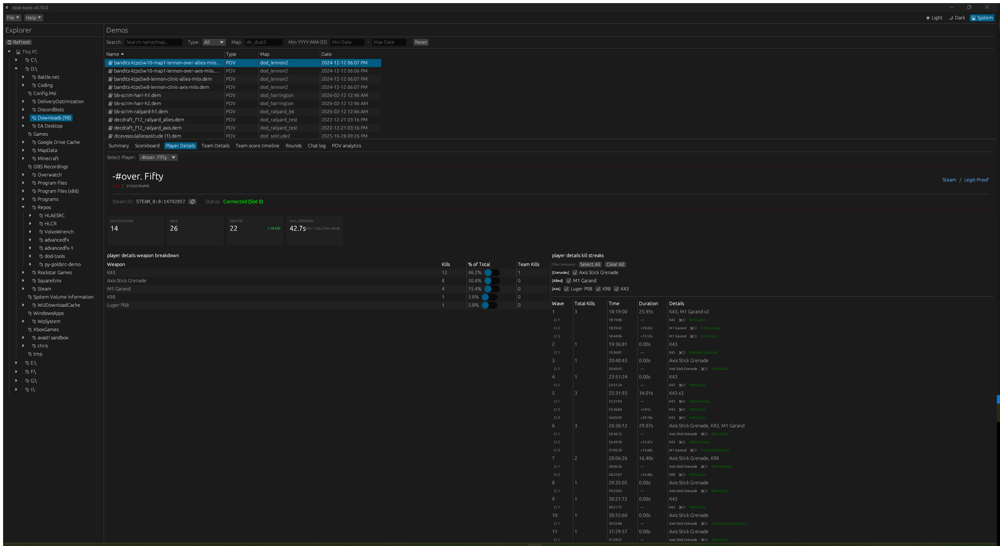
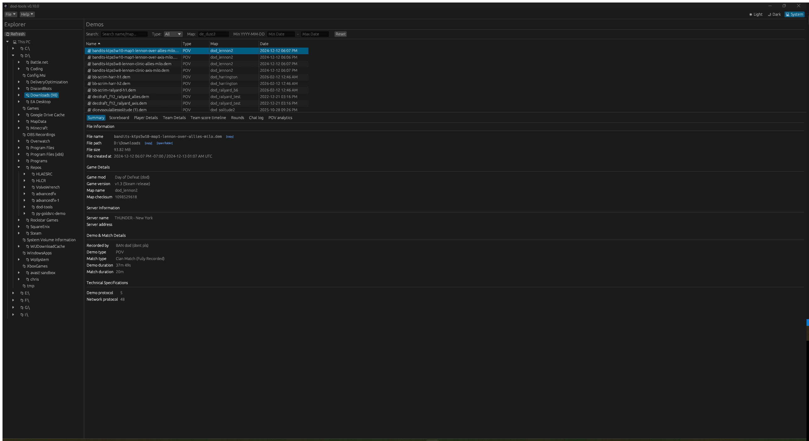
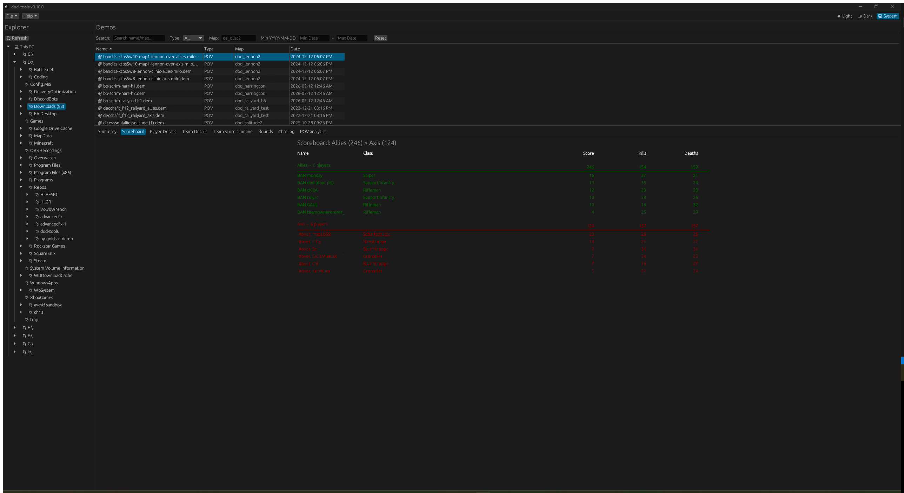
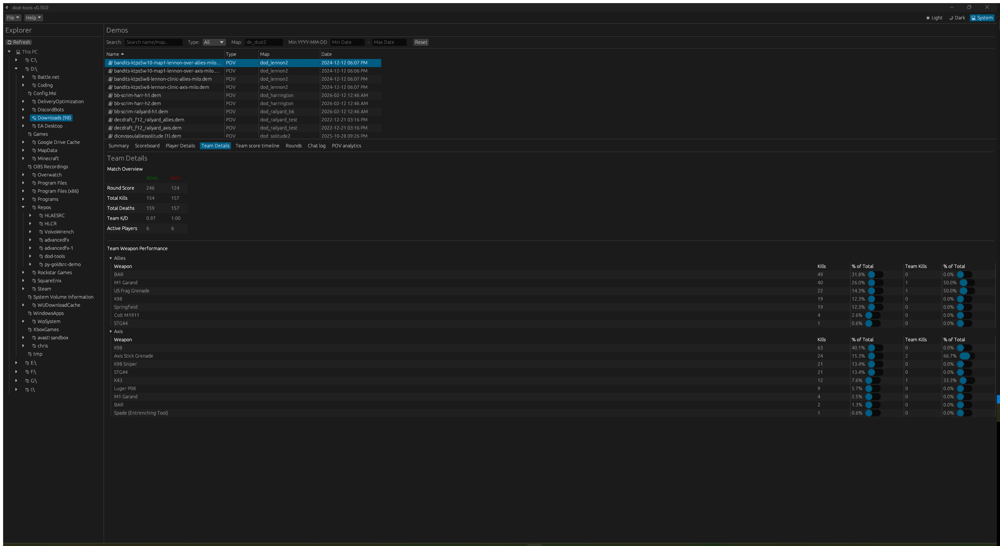
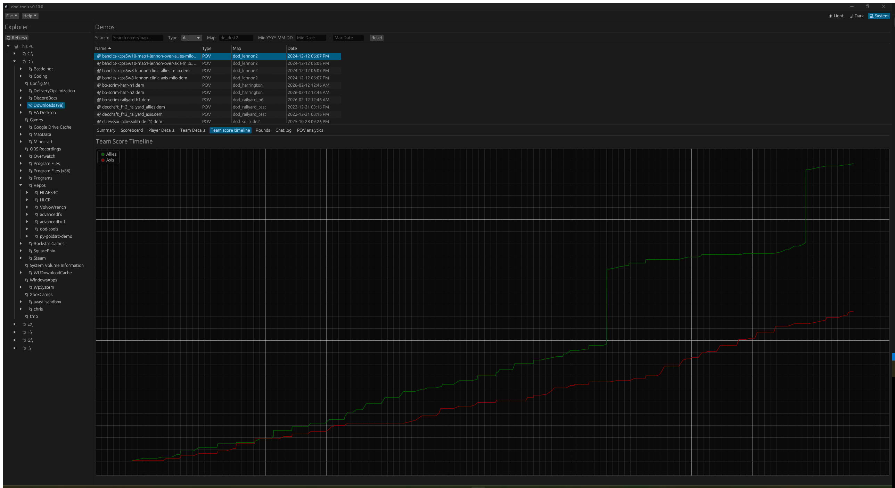
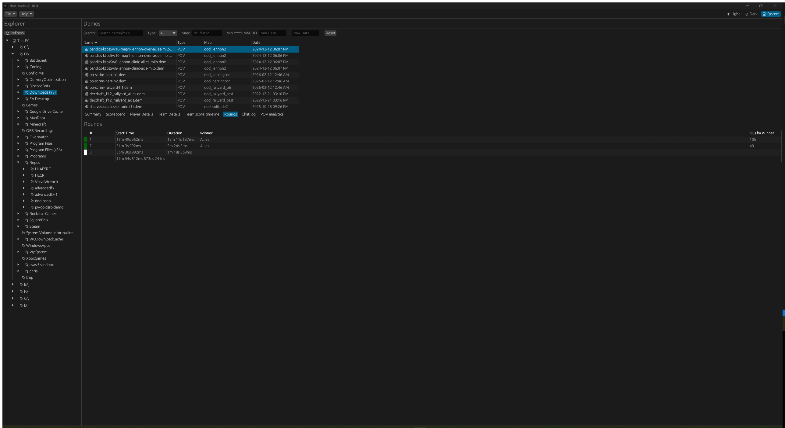
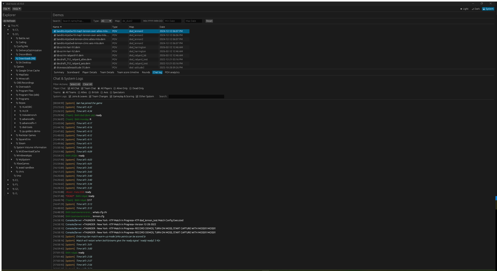
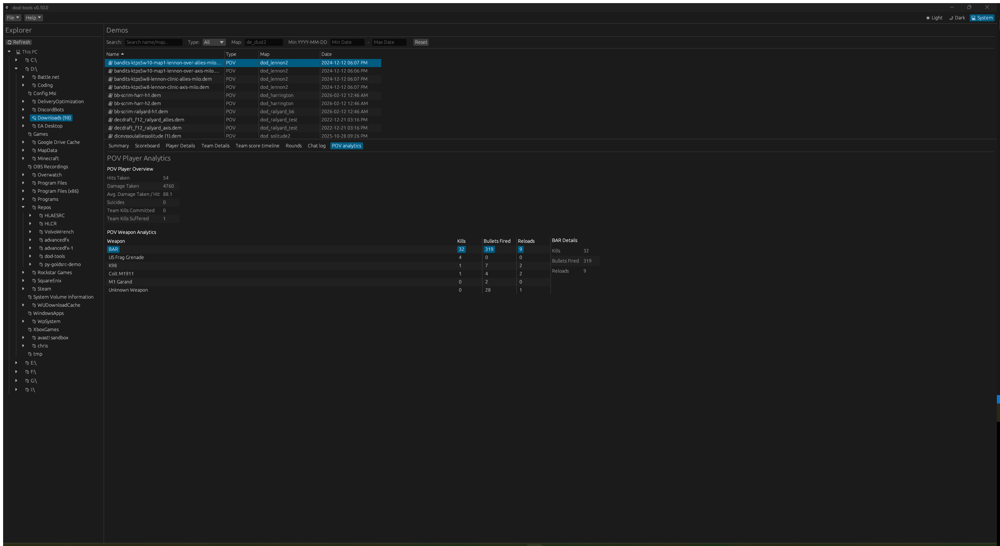

# Day of Defeat Demo Analyzer & Tools

🎮 A creative fork of the original [cgdangelo/dod-tools](https://github.com/cgdangelo/dod-tools) project, putting a fresh spin on Day of Defeat v1.3 demo analysis. 

## 💡 About this Fork
This is a passionate, work-in-progress playground. It is heavily inspired by classic tools like **Complexity Demo Player**, aiming to bring detailed game states, team comparisons, and visual overviews into a modern, native desktop dashboard.



> [!WARNING]
> **WebAssembly (WASM) Target Status:**
> A GitHub Pages deployment workflow is active and performance optimizations are merged. The WASM build compiles via trunk for web deployments, but it remains a work in progress. The web target may lag behind the native desktop app in functionality, and advanced features (like local folder localization scanning or background thread progress) may be disabled or limited by browser security sandboxes. For the complete, uncompromised feature set, compile and run the native desktop target.

---

## 📑 Table of Contents

* [Key Features](#key-features)
* [Interactive GUI Tabs Walkthrough](#interactive-gui-tabs-walkthrough)
* [Workspace Architecture](#workspace-architecture)
* [Getting Started & Usage](#getting-started--usage)

---

## 🚀 Key Features

* **Interactive GUI Dashboard:** A sleek, fully responsive `egui`-based GUI featuring:
  * **File Explorer:** Side panel for navigating demo folders with automatic map and metadata caching, demo list search, filtering, pinned folders, and persistent directory history.
  * **Summary View:** Detailed metadata of match maps, protocol versions, game version, durations, server name/IP, Map Checksums, and timezone tracking.
  * **Capture Studio:** Unified dashboard for automated highlight capturing, batch demo patching, and HLAE/FFmpeg video rendering queue management.
  * **Scoreboard:** Players grouped by team (Allies/British vs. Axis) with aggregated scores, kills, and deaths. Shows reconnection markers (`🔄`) and pre-demo activity markers (`*`).
  * **Player & Team Details:** Detailed metrics, weapon efficiency, and web profile links (Steam Profile & Legit-Proof).
  * **Timeline Plot:** Graph of Allies vs. Axis score changes throughout the match.
  * **Rounds & Chat Log:** Round-by-round results and color-coded system logs/chat logs (Allies, Axis, British, Spectators).
  * **POV Analytics:** Gunplay breakdowns, reload counts, shot accuracy, and scoped/noscope ratios for POV player demos.
* **CLI Analysis Tool:** Programmatic command-line demo parsing generating structured Markdown, CSV, or JSON outputs for automated league/statistic processing.
* **Deduplication Auditor:** Scan entire demo folders to identify duplicate files, canonical paths, and audit stats.

---

## 🖼️ Interactive GUI Tabs Walkthrough

Below are the actual interface views and features available within the native desktop app:

### 1. Summary

* **Description:** Displays structured metadata about the demo file and the game session:
  * **File Information:** File name, path, size, creation date, and total demo duration. Includes quick click-to-copy buttons and native file explorer links.
  * **Game Details:** Game mod (e.g., `Day of Defeat`), engine version (`1.3 (GoldSrc)`), active map, game mode, and active teams.
  * **Server Information:** Hostname, IP address/port, server location (e.g., Paris, France), active player count, and VAC status.
  * **Demo & Match Details:** Recorded by nickname (for POV demos) or HLTV proxy slot name, demo type (POV vs HLTV), match type classification (Clan Match vs Public Game), and computed match length.
  * **Technical Specifications:** Demo protocol and network protocol versions.

### 2. Scoreboard

* **Description:** A team-grouped overview of players active in the demo:
  * **Faction Divisions:** Separates players under Allies (or British) and Axis sections, with team-color styling and visual dividers.
  * **Team Totals:** Displays aggregated stats (total score, total kills, and total deaths) for each faction.
  * **Detailed Columns:** Displays player names, active classes, scores, kills, and deaths.
  * **Status Indicators:** Highlights reconnecting players with a reload symbol (`🔄`) and pre-demo active players with an asterisk (`*`) with rich tooltips detailing potential stat variations.

### 3. Player Details

* **Description:** A deep dive into an individual player's performance:
  * **Player Selector:** A combobox dropdown synced with scoreboard row highlights.
  * **Visual Metrics Cards:** Large visual summary boxes showing Match Score, Kills, Deaths, and Avg. Lifespan.
  * **Weapon Efficiency Table:** Lists weapons used, kills achieved, friendly fire, and percentages of total kills.
  * **Profile Quick-links:** Dynamic links to Legit-Proof and Steam Community profiles for Steam ID lookup.

### 4. Team Details

* **Description:** Side-by-side comparison of Allies vs. Axis metrics, displaying round scores, team-wide K/D ratios, and active player counts.

### 5. Team Score Timeline

* **Description:** A graphical plot of round scores over time. Plots Allies and Axis scores on a coordinate grid to show scoring trends and momentum throughout the match.

### 6. Rounds

* **Description:** A tabular list of rounds tracking round numbers, start times (elapsed demo time), round durations, round winners, and kills scored by the winning team.

### 7. Chat Log

* **Description:** An advanced filtering log console:
  * **Filters:** Toggle public (all) chat, team chat, alive players, dead players, specific team factions (Allies, Axis, British, Spectators), and system categories (joins/leaves, team changes, gameplay/scoring, other).
  * **Team Color Mentions:** Renders faction names (Allies, Axis, British, Spectators) in their respective colors.
  * **Formatting:** Displays system announcements with clean `[system]` headers and trims raw console command artifacts.

### 8. POV Analytics

* **Description:** Custom statistics for the player who recorded the demo (only available on POV demos):
  * Measures bullets fired, reload counts, suicides, team kills committed and suffered, hits/damage taken, and average damage taken per hit.
  * Shows weapon details like scoped vs. noscope kills and scoped ratios.

### 9. Capture Studio
* **Description:** Unified workspace to automate demo recording sequences for highlights:
  * **Queue Review:** Manage highlight export tasks, configure settings overrides (FF speed, buffers, initial delay, etc.), and rename output files.
  * **HLAE Capture:** Sequentially execute the patched demo highlights through HLAE to render high-quality video frames.
  * **HLCR Render:** Configure audio and video transcoding settings to generate output movie clips using FFmpeg.

---

## 🛠️ Workspace Architecture

The repository is structured as a modular Rust cargo workspace:

* **[dod](./dod)**: Low-level binary parser library utilizing `nom` and `dem` to decode network packets, user messages, and console commands close to the raw protocol.
* **[analysis](./analysis)**: Analytics engine consuming parsed structures to maintain game state, compute statistics, format chat, and track rounds.
* **[native](./native)**: Delivery binaries.
  * `dod-tools-gui`: Desktop/WASM UI built on `egui`.
  * `dod-tools-cli`: Command-line tool.
* **[hl-demo-auditor](./hl-demo-auditor)**: Command-line audit program to locate and clean up duplicate files.

---

## 🚀 Getting Started & Usage

### 1. GUI Desktop Mode
Compile and run the GUI application natively:
```powershell
cargo run -p native --bin dod-tools-gui
```

### 2. GUI WebAssembly (WASM) Mode
Ensure `trunk` is installed, then build and launch the local server from the workspace root:
```powershell
trunk serve
```
* **Browser Runtime:** Runs the parser and analyzer client-side directly in the browser using HTML5 `<canvas>` and `egui`.
* **Zero Server Overhead:** Demos are processed locally in-browser via drag-and-drop or file upload selectors—no remote servers or databases required.

### 3. CLI Mode
Run the command-line utility on single or multiple demo files:
```powershell
cargo run -p native --bin dod-tools-cli -- "C:\path\to\demo.dem"
```

#### 📋 Extended CLI Examples

* **Output a Markdown report to clipboard (Windows):**
```powershell
cargo run -p native --bin dod-tools-cli -- "C:\path\to\demo.dem" | clip
```

* **Output JSON metadata to a file:**
```powershell
cargo run -p native --bin dod-tools-cli -- --output-format json "C:\path\to\demo.dem" > report.json
```

* **Batch auditing duplicates:**
```powershell
cargo run -p hl-demo-auditor -- "C:\path\to\demos_directory"
```
