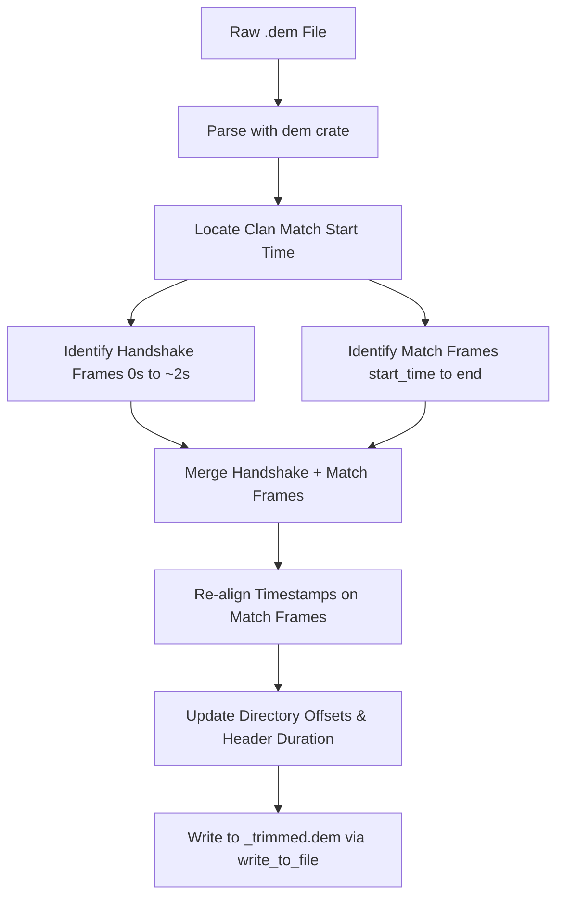

# Future Improvements - spec: Trim Demo(s)

This document outlines future feature ideas and detailed design specifications for implementation.

---

## Feature Spec: "Trim Demo(s)" Tool

### 1. Goal
Trim a Day of Defeat (GoldSrc) demo file (`.dem`) down to only the time a clan match is actually played, stripping out the pre-game warmup/setup time to reduce file sizes and skip directly to the gameplay.

### 2. User Interface & Workflow
* **Top Menu Bar**: Add a new dropdown menu labeled **"Tools"** directly to the right of the **"File"** menu.
* **Menu Options**: Add an option labeled **"Trim Demo(s)..."**.
* **Window/Modal UI**: Clicking "Trim Demo(s)" opens a modal window:
  * **File Selection**: Allows selecting one or more `.dem` files (supporting batch processing).
  * **Trimming Strategy**:
    * *Auto (Clan Match)*: Automatically detects the start of the match using the analysis engine's clan match detection.
    * *Manual Range*: Allows inputting a start time (MM:SS) and end time (MM:SS).
  * **Trimming Action**: Runs the process in a background thread with a progress bar and displays a success popup upon completion.
  * **Output**: Writes the output file to the same directory with the suffix `_trimmed` (e.g., `match_trimmed.dem`).

---

### 3. Technical Implementation & Architecture



#### Step A: Match Start Detection
Run a fast preliminary analysis pass on the demo:
1. Locate the first round start event (`RoundStart` net message or when scores reset to 0-0).
2. Note the `viewdemo` time or frame timestamp where this occurs (e.g. `T_start = 120.0` seconds).

#### Step B: Handshake Preservation
A GoldSrc demo is a recording of network state updates. Simply slicing from `T_start` will delete initial server handshake packets, causing the client to crash on load.
1. Identify all setup/handshake packets from the first 2 seconds (e.g., frames in `0.0s <= time <= 2.0s`).
2. These contain critical initialization messages:
   * `SvcServerInfo` (map name, game dir, player counts)
   * `SvcUpdateStringTable` (model and sprite index tables)
   * `SvcResourceList` (sound/model caches)

#### Step C: Gameplay Slicing
1. Keep the handshake frames (first 2 seconds).
2. Discard all frames between `2.0s` and `T_start`.
3. Keep all frames from `T_start` to the end of the demo.

#### Step D: Timestamp Re-alignment
Because you deleted the warmup segment, the remaining frames will have a timeline gap.
1. Let `offset = T_start - 2.0`.
2. For all frames after the warmup slice, subtract `offset` from the `frame.time` field:
   ```rust
   frame.time -= offset;
   ```
3. This aligns the match start frames directly after the handshake frames, ensuring a smooth, uninterrupted playback flow.

#### Step E: Directory & Header Reconstruction
1. Update `demo.header.directory_offset` with the new file directory offset since the frame length changed.
2. Re-compute the duration in the header.
3. Update the directory entries (`demo.directory.entries` offsets and frame count values).
4. Save the modified struct using `demo.write_to_file(path)`.

---

### 4. Edge Cases to Handle
* **No Match Detected**: Fall back to starting the trim from `0:00` (retaining full warmup) or prompt the user for a manual start time.
* **HLTV vs. POV Demos**:
  * HLTV demos contain director messages and multiple camera viewpoints.
  * POV demos contain personal console commands and client inputs.
  * The trimming script should inspect the headers and ensure all frame data types are matched correctly without breaking layout logic.

---

## Feature Spec: "Gameplay & Chat Analytics"

Based on raw network message inspections across 50 unique demos, several valuable metrics can be extracted to expand the tool's feature set.

### 1. Registering the `ScoreInfo` Message (Bug Fix & Enhancement)
* **Discovery**: The `ScoreInfo` message occurs in 100% of tested demos (743 total occurrences). Although the struct definitions for `ScoreInfo` and `ScoreInfoLong` exist in the `dod` crate, they are never registered in the `UserMessage` enum or parsed in `UserMessage::new`. Consequently, the parser silently ignores them.
* **Fix/Feature**: Register `ScoreInfo` and `ScoreInfoLong` in the `dod` library parser, allowing direct scoreboard syncs of client index, points, kills, deaths, class, and team.

### 2. "Chat Logs" GUI Tab (`SayText`)
* **Frequency**: 2,131 occurrences (100% penetration across demos).
* **Feature**: Parse `SayText` user messages, resolve player names/Steam IDs, and display a scrollable "Chat Log" tab in the GUI report showing player banter and ready-up messages.

### 3. "Objective Gameplay" Metrics (`CapMsg` & `CancelProg`)
* **Frequency**: 2,260 `CapMsg` captures and 286 `CancelProg` capture interruptions.
* **Feature**: Display objective capture statistics (e.g. "Most Flags Captured", capture timelines) on a new "Objectives" tab.

---

## Backlog & Feature Ideas

### HL Demo Auditor (HLDA)
* **Duplicate Detection Accuracy**: Verify that POV (Point-of-View) demos recorded by different players in the same match are not flagged as duplicates. (Confirm that differences in initial client handshakes, command streams, and viewpoints result in distinct sizes/hashes).
* **Double Listing Bug**: Fix cases where the same demo file name is listed twice in reports.

### GUI & Core Analysis (`hl-tools` / `dod-tools`)
* **Project Renaming**: Find a better, generic name to replace `dod-tools` to reflect generic Half-Life demo analysis as it expands to CS 1.6, TFC, other GoldSrc mods, and eventually Source/Source2 engines.
* **Kill Streak UI Improvements**: Add spacing/timing intervals inside kill streaks to show how close together kills are within a single streak.
* **Game Version Relocation**: Move the game version out of the Summary tab details. Consider placing it in the `.exe` application title bar, or in a Help -> "About" menu option.
* **Advanced Charts & Visuals**: Integrate more charts and graphs for gameplay stats.
* **"Fun Facts / Stats" Tab**: Add a page for fun metrics (e.g., *"Warchyld killed the most teammates with grenades!"*, most self-kills, longest life, quickest death).
