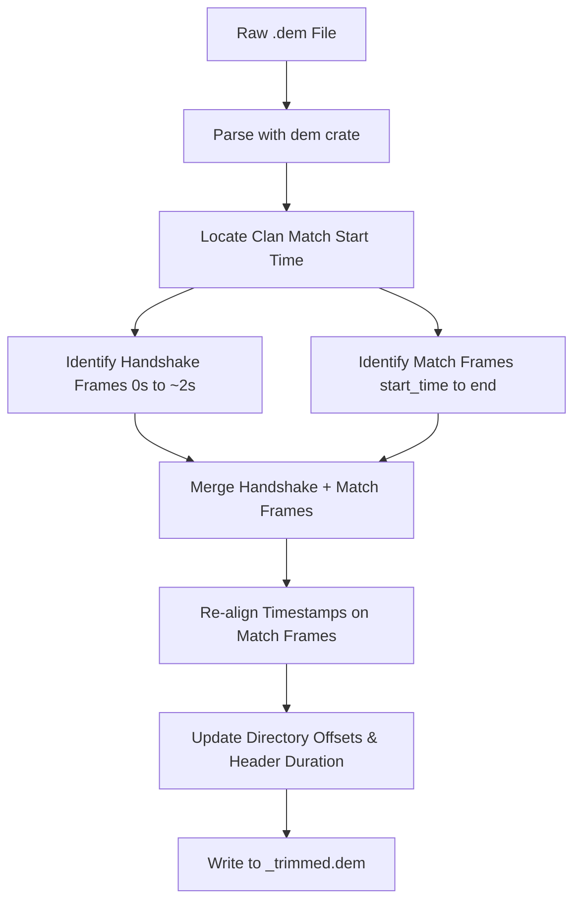

# 📋 Project Backlog & Future Improvements

This document tracks upcoming features, performance optimizations, and UI improvements for the Half-Life/Day of Defeat demo tools.

---

## ⚡ Active Task Board (Sorted by Difficulty)

Below are the remaining open tasks in the backlog, structured as a clean, scannable table sorted from easiest to hardest.

| ID | Difficulty | Task | Area | Description | Dev Notes |
| :--- | :--- | :--- | :--- | :--- | :--- |
| **M7** | 🟡 **Medium** | **WASM Translation Assets** | GUI / WASM | Embed translation catalogs (e.g. `dod_tools_english.txt`) inside compiled binaries to enable WebAssembly translation. | Use `include_str!("../localizations/dod_tools_english.txt")` to bundle the default catalog directly into the binary for WASM runtime access. |
| **M8** | 🟡 **Medium** | **Lock-Free Concurrent Lookups** | Core / UI Thread | Replace the localization wrapper's `Mutex` with a read-mostly `RwLock` or `ArcSwap` to prevent widget thread contention. | Refactor the translation cache in `analysis/src/lib.rs` to use `std::sync::RwLock` or `once_cell` instead of standard `Mutex` locks. |
| **M9** | 🟡 **Medium** | **POV Client Duplicate Protection** | CLI / Auditor | Use client headers/viewpoints rather than just file sizes/hashes so same-match POVs from different players aren't flagged as duplicates. | Extract POV player index/header metadata during audit scans and add them to the file uniqueness hash signature. |
| **M10** | 🟡 **Medium** | **Project Renaming** | Project / Core | Rename the repository to support a broader set of Half-Life mods (e.g., CS 1.6, Team Fortress Classic). | Perform workspace-wide search & replace of `"dod-tools"` to the new project identifier and rename root config/directories. |
| **M11** | 🟡 **Medium** | **Server Mod Detection** | Parser / GUI | Detect common server-side mods (AMX/AMXX, Warcraft 3, Super Hero) present during a recorded demo and surface them in the UI. | Scan `TextMsg` / `HudText` / `Motd` content for known plugin signatures (e.g., `[AMX]`, `[ADMIN]`, XP/gold HUD text). Store detected mods as `Vec<DetectedMod>` on `AnalyzerState`. **Important**: presence of AMX must *not* influence match-type classification — KTP is a competitive league that uses AMX heavily. Decide placement (Summary section? tooltip? dedicated field?) before implementing. |
| **M14** | 🟡 **Medium** | **Group Scoreboard by Team** | GUI / Scoreboard | Remove the "Team" column from the scoreboard table and group players under separate Allies/British and Axis headings. | Refactor `native/src/bin/gui/views/scoreboard.rs` to split the player list by team and build separate tables (or segmented headers) using `TableBuilder` with visual gaps in between them. |
| **M15** | 🟡 **Medium** | **Announce Round Cap-Outs in Chat** | GUI / Chat Log | Display team cap-out messages (e.g. "Axis Forces Have Capped Out") in the Chat Log tab. | Identify and extract the specific `TextMsg` or `HudText` strings related to team round/match cap-outs (e.g., `#Game_Axis_Capped`) and append them as system announcements to the chat log. |
| **M16** | 🟡 **Medium** | **Robust Demo Type Guessing** | Parser / Core | Fix the issue where demo type (POV vs HLTV) is guessed on initial parse and then flips or changes after a full parse when clicked. | Implement a lightweight initial scan of the first few packets, or maintain a persistent metadata cache. (See detailed spec below). |
| **M17** | 🟡 **Medium** | **Announce Flag Captures in Chat** | GUI / Chat Log | Add single-point and double-point flag capture events to the Chat Log. | Track the flag cap events (`CapMsg` or team scoring triggers) in the demo parser, extract the player and flag name, and format them as system chat messages (e.g., `"[system] Player captured Center Flag (+1 point)"`). |
| **M18** | 🟡 **Medium** | **Demo List Search & Filtering** | GUI / Layout | Add filtering controls (by type, map, date range, search query) and a "Reset Filters" button above the demo list. | Add search query and criteria state to the Explorer UI in `native/src/bin/gui/main.rs` and filter the file list before drawing tree nodes or rows. |
| **M19** | 🟡 **Medium** | **Explorer Folder Collapsing State Fix** | GUI / Layout | Allow collapsing a folder in the Explorer tree even if the active file is a child of the folder being closed. | Modify the node selection/expansion logic in `native/src/bin/gui/explorer.rs` to prevent auto-expanding parents if they are collapsed by manual user click. |
| **M20** | 🟡 **Medium** | **Score Reset Resiliency** | Parser / Core | Handle KTP league score updates at the start of the second half to prevent incorrect round-winner or score tracking. | Implement logic in `analysis/src/lib.rs` that detects a mid-match score override/reset at the start of a half and adjusts round counting base values accordingly rather than mis-assigning point deltas. |
| **H1** | 🔴 **Hard** | **Combine Weapon & POV Tabs** | GUI / Layout | Merge "Weapon Breakdowns" and "POV Analytics" into a player dropdown selector. Show extra POV stats with visual notes only when the POV player is chosen. | Merge `views/weapons.rs` and `views/pov.rs` into a unified player details view. Add dynamic checks to append the POV analytics grid when the POV player is active. |
| **H2** | 🔴 **Hard** | **Objective Capture Timelines** | Parser / GUI | Track flags captured (`CapMsg`) and interruptions (`CancelProg`) to display objective capture timelines. | Track `CapMsg` and `CancelProg` network messages in `analysis/src/lib.rs` and build a horizontal time-based timeline widget in the GUI. |
| **H3** | 🔴 **Hard** | **Objective Capture Timelines** | Parser / Core | Trace POV ammo box creation/pickup/decay timelines by decoding delta packet updates (`SvcDeltaPacketEntities`). | Parse `SvcPacketEntities` updates and `SvcDeltaPacketEntities` decoders in `analysis/src/lib.rs` to map `models/w_ammobox.mdl` lifetimes. |
| **H4** | 🔴 **Hard** | **Zero-Copy String Decoding** | Parser / Core | Refactor the binary parser to yield `Cow<'a, str>` string slices rather than allocating owned `String` instances. | Change `String` fields in `dod` user messages to `Cow<'a, str>` and propagate lifetime bounds throughout the nominal parser library. |
| **H5** | 🔴 **Hard** | **Streaming Demo Parser** | Parser / Core | Fork/rewrite `dem` to stream frames sequentially, reducing memory allocation footprint to $O(1)$. | Refactor the `dem` crate parser to run as an iterator yielding sequential frames rather than pre-allocating an entire vector of parsed frames. |
| **H6** | 🔴 **Hard** | **Vec Capacity Pre-allocation** | Parser / Core | Pre-allocate collections (rounds, chat logs) using size-based heuristics to minimize reallocation cycles. | Pre-allocate capacities on vectors (e.g. `Vec::with_capacity`) inside `analysis/src/lib.rs` state updates using demo file size scale factors. |
| **H7** | 🔴 **Hard** | **"Trim Demo(s)" Tool** | CLI / Core | Slice and trim out demo warmups/setup times (detailed spec below). | Implement the trimming specification (handshake capture, warmup frame pruning, directory rebuilding) in a CLI command. |
| **H8** | 🔴 **Hard** | **Background Threaded Demo Loading** | GUI / Threading | Prevent the GUI main thread from freezing when loading large demos. Move demo parsing to a background thread and report progress steps/percentage to the UI spinner/bar. | Offload parsing calls to a Rust thread or tokio task, communicating step-by-step progress through a channel to egui. (See detailed spec below). |

---

## ✅ Completed Tasks

Below is a history of all successfully implemented and verified tasks.

| ID | Difficulty | Task | Area | Description | Dev Notes |
| :--- | :--- | :--- | :--- | :--- | :--- |
| **[x] E1** | 🟢 **Easy** | **Scoreboard Columns Removal** | GUI / Scoreboard | Remove `"Avg. Life"`, `"Min. Life"`, and `"Max. Life"` columns to move them to a dedicated player details page later. | *Completed:* Removed corresponding `TableBuilder` column definitions, headers, row labels, and sorting logic from `native/src/bin/gui/views/scoreboard.rs` while keeping the underlying stats in the backend Player model. |
| **[x] E2** | 🟢 **Easy** | **Analyzer Version Relocation** | GUI / Summary | Relocate the `dod-tools` analyzer application version string out of the Summary tab and into the window title bar or a Help -> "About" menu. | *Completed:* Updated `native/src/bin/gui/main.rs` to format window title with package version and removed the grid row in `summary.rs`. |
| **[x] E3** | 🟢 **Easy** | **Chat Formatting: Square Brackets** | GUI / Chat Log | Format system announcements using square brackets (e.g., `[system]`) instead of round brackets `(system)`. | *Completed:* Changed `#app_chat_system_prefix` from `"(system)"` to `"[system]"` in the localization resources. |
| **[x] E4** | 🟢 **Easy** | **Chat Formatting: Spacing Trim** | GUI / Chat Log | Clean up extra padding and spaces (e.g., trim multiple spaces around nicknames and colons). | *Completed:* Refactored `chat.rs` layout spacing and trimming so nicknames have no spaces before colon and exactly one space after. |
| **[x] E5** | 🟢 **Easy** | **Filter POV Engine Messages** | GUI / Chat Log | Suppress client/POV engine logging (like `"[07:48:88] (system) First Person"`) to declutter chat. | *Completed:* Filtered out client-side camera/spectator messages (`OBS_` and `Spec_Mode` logs) during parsing so they aren't stored in memory or shown. |
| **[x] E6** | 🟢 **Easy** | **Friendly Weapon Names** | GUI / UI Tables | Translate raw demo weapon identifiers (e.g., `Kabar`) to friendly names (e.g., `"Knife"`) for a polished user experience. | *Completed:* Created a `weapon_name` localization helper in `views.rs` mapping weapon variants to localized keys (Option B) with title-case fallback. |
| **[x] E7** | 🟢 **Easy** | **Double Listing Filenames Bug** | CLI / Auditor | Resolve the CLI issue where identical demo files occasionally print twice in audit summaries. | *Completed:* Canonicalized and deduplicated paths in `find_duplicates` to prevent identical files from being listed or processed twice. |
| **[x] E8** | 🟢 **Easy** | **Summary Durations Display** | GUI / Summary | Display total demo playback duration and active match play duration in the Summary tab. | *Completed:* Added `"Demo duration"` and `"Match duration"` lines to `summary.rs` using `humantime` formatting and made `current_time` in `AnalyzerState` public to calculate match length. |
| **[x] E9** | 🟢 **Easy** | **Summary Layout Restructuring** | GUI / Summary | Structure Summary tab into File, Demo, and Tech sections, split file path/name, and extract/render recorder's name. | *Completed:* Restructured `summary.rs` layout, split name/path, added section dividers, and captured HLTV proxy name when parser encounters HLTV slot update in `player.rs`. |
| **[x] E10** | 🟢 **Easy** | **Victim Column in Streaks** | GUI / Streaks | Add a "Victim" column to the kill streak breakdown table to show who was killed on each specific kill in a streak. | *Completed:* Integrated `PlayerGlobalId` of the victim in `KillStreak::kills`, implemented Option 2 layout combining Weapon + Victim name in streaks breakdown table, added scoreboard selection highlight sync, styled with team color and hand cursor, and updated CLI patterns. |
| **[x] M1** | 🟡 **Medium** | **Kill Streaks Dropdown Selection** | GUI / Streaks | Re-layout the Streaks tab to use a player-selection dropdown rather than cramming all players into nested collapsible lists. | *Completed:* Implemented `egui::ComboBox` dropdown synced with scoreboard row highlighting. |
| **[x] M2** | 🟡 **Medium** | **Color-Coded Team Mentions** | GUI / Chat Log | Render team names in team colors (e.g. "Axis" in red, "Allies" in green) in system announcements. | *Completed:* Implemented dynamic case-insensitive team pattern scan (supporting Allies, Allied, Axis, and Spectators) styling matching segments in their respective colors in `chat.rs`. |
| **[x] M4** | 🟡 **Medium** | **Kill Streak Filters & Timings** | GUI / Streaks | Add streaks filtering (include/exclude weapons) and display millisecond intervals between kills. | *Completed:* Added weapon filter checkboxes with Select All/Clear All options grouped by category (Grenades, Melee, Allied, Axis), and calculated/displayed millisecond intervals between sequential kills. |
| **[x] M12** | 🟡 **Medium** | **Kill/Death Counting Accuracy & Partial-Data UI Markers** | Parser / Core / GUI | Fix scoreboard stats for players who disconnect/rejoin and show partial-data/reconnect warnings. | *Completed:* Implemented Option D (Session Snapshot & Accumulation) to sum stats across reconnects. Added amber banner warning UI for demos started late/ended early showing exact boundary TimeLefts. Rendered player name markers 🔄 and * with rich tooltips for reconnects and pre-demo activity. |
| **[x] M13** | 🟡 **Medium** | **British Team Support** | Parser / GUI / Core | Add `Team::British` throughout the codebase. British maps are rare in clan matches but common on pub servers with custom maps. | *Completed:* Added `Team::British` variant, `Class::is_british()` helper, and dynamically promoted `Team::Allies` to `Team::British` in the analyzer state. Updated scoreboard, chat, weapons, timeline, and rounds formatting with British Gold/Yellow colors. |
| **[x] E11** | 🟢 **Easy** | **POV Analytics Border Style Fix** | GUI / Layout | Remove the unnecessary canvas frame border around the text details panel in the POV Analytics tab. | *Completed:* Removed the `egui::Frame::canvas` wrapping around the details grid in `native/src/bin/gui/views/pov.rs` to make it render cleanly without a contrasting background box. |
| **[x] E12** | 🟢 **Easy** | **Server Details in Summary** | GUI / Summary | Display the server name and IP address/port in the Summary tab for a quick reference on where the match was played. | *Completed:* Extracted the server name and address/IP/port from the demo's server info network messages, `SvcStuffText` commands, and `ConsoleCommand` frames, stored them in `AnalyzerState`, and displayed them in the Summary tab with a click-to-copy button. |
| **[x] E14** | 🟢 **Easy** | **Copy Filename & Open Folder** | GUI / Summary | Provide button icons in the Summary tab next to the filename and file path fields to easily copy the filename or open the directory. | *Completed:* Added small copy icons (`📋`) for filename and path, and a folder icon (`📁`) to open the parent folder in File Explorer on native targets. |
| **[x] M5** | 🟡 **Medium** | **ScoreInfo Message Syncing** | Parser / Core | Register `ScoreInfo` / `ScoreInfoLong` user messages in the `dod` parser to sync scoreboard data. | *Completed:* Registered `ScoreInfo` and `ScoreInfoLong` in `dod` message parser and integrated them into the analysis engine to sync stats, class, and team details. |
| **[x] M3** | 🟡 **Medium** | **Chat Filter Logic Overlap** | GUI / Chat Log | Fix player filter toggles so that unchecking "Alive" and "Dead" doesn't permanently lock all chat channels. | *Completed:* Decoupled the chat visibility filters in `chat.rs` so that unchecking `"Alive"` and `"Dead"` switches them to a default fallback state showing all messages instead of fully hiding chat. |
| **[x] E13** | 🟢 **Easy** | **Player Profile External Links** | GUI / Scoreboard | Add quick web links to popular profiling services (e.g. Legit-Proof, Steam Community) next to a player's ID on the scoreboard. | *Completed:* Consolidated external links (Steam profile and Legit-Proof) directly into the Player Details view. |
| **[x] E15** | 🟢 **Easy** | **Clean Up System Message Formatting** | Parser / Chat Log | Trim or clean up trailing newlines and raw console command arguments (like `"\nready2 3 4\n"`) from system announcements. | *Completed:* Implemented raw console command filtering and newline/whitespace normalization in system message translation, with associated tests. |
| **[x] M6** | 🟡 **Medium** | **Maximize Tab Space Layout** | GUI / Layout | Expand widget layouts to consume the full screen width and height since the side-by-side demo comparison panel is gone. | *Completed:* Adjusted default widget widths/margins and TableBuilder Column configurations in `native/src/bin/gui/views/` to occupy 100% of the screen. Centered the scoreboard view and bounded its width to 50% of the screen. |

---

## 📋 Detailed Feature Specifications

### 1. "Trim Demo(s)" Tool [H7 - 🔴 Hard / High Effort]
Trim a Day of Defeat (GoldSrc) demo file (`.dem`) down to only the time a clan match is actually played, stripping out warmup/setup time to reduce file sizes.

> [!NOTE]
> A GoldSrc demo is a recording of network state updates. Simply slicing from the start of a match will delete initial server handshake packets, causing the client to crash on load.



#### Trimming Steps
1. **Match Start Detection**: Find the first round start event (`RoundStart` net message or when scores reset to 0-0). Note timestamp `T_start`.
2. **Handshake Preservation**: Identify initialization packets from the first 2 seconds (`0.0s <= time <= 2.0s`) like `SvcServerInfo`, `SvcUpdateStringTable`, and `SvcResourceList`.
3. **Gameplay Slicing**: Discard all frames between `2.0s` and `T_start`. Keep handshake frames and gameplay frames after `T_start`.
4. **Timestamp Re-alignment**: Subtract offset `T_offset = T_start - 2.0` from all frames after warmup to align them cleanly after handshake.
5. **Directory & Header Reconstruction**: Update `directory_offset`, directory entries, frame counts, and total duration, then write output.

> [!WARNING]
> **POV vs HLTV Demos**: POV demos contain personal console commands and client inputs, while HLTV contains director messages and camera slots. Timings must be validated on both architectures.

---

### 2. Kill/Death Counting Accuracy Across Reconnects [M12 - 🟡 Medium]

The scoreboard currently derives kill and death counts from server-sent absolute-total packets (`ScoreShort`, `Frags`, `ObjScore`). These are accurate as long as the server preserves a player's stats across a disconnect/reconnect — but **standard GoldSrc resets a player's server-side stats to zero on reconnect**, even if the Steam ID is the same.

#### The Problem

> **Example:** Player A gets 5 kills and 0 deaths, disconnects, rejoins, then gets 2 more kills and 3 deaths.
>
> - **Correct result:** 7 kills, 3 deaths
> - **Current result (if server resets on reconnect):** 2 kills, 3 deaths — because the post-reconnect `Frags` packet reports `frags=2` (server restarted from 0) and overwrites the preserved 5.

All individual kill and death events **are present in the demo file** as `DeathMsg` packets (broadcast to every client at the time of the kill), so the raw data is available to count correctly.

#### Root Cause

The analyzer stores stats as the last absolute value received from the server:

- `Frags.frags` → overwrites `player.stats.1` (kills)
- `ScoreShort.kills` → overwrites `player.stats.1` (kills)
- `ScoreShort.deaths` → overwrites `player.stats.2` (deaths)
- `ObjScore.score` → overwrites `player.stats.0` (score)

On reconnect, a new server-side session begins. The server sends a fresh `Frags` starting from 0, which silently discards the pre-disconnect counts stored on the local player record.

---

#### Option A — `DeathMsg`-only counting (independent accumulator)

**How it works:** Ignore `Frags`/`ScoreShort` for kills and deaths entirely. Add two new fields to `Player`: `kills_counted: u32` and `deaths_counted: u32`. Increment them on every `DeathMsg` where the player is killer or victim, resolved through the current slot-to-player mapping at the time each event fires.

**Pros:**
- Completely immune to server-side stat resets — counts every event in the demo regardless of reconnects.
- Simple, deterministic, easy to test.
- `DeathMsg` is already in the event pipeline and parsed.

**Cons:**
- **Wrong for mid-join demos.** If the recording starts partway through a match, all `DeathMsg` events before the recording began are missing. The counted kills/deaths for players who were already active will be understated.
- Ignores `Frags`/`ScoreShort` entirely, so any server-side corrections (e.g. admin-adjusted scores) are not reflected.
- Objective score still cannot be counted from events alone — there is no per-capture score-change packet — so `ObjScore` must still be used for `stats.0`.

**Verdict:** Best for full-game HLTV demos. Incorrect for partial recordings.

---

#### Option B — Server value as a floor, `DeathMsg` as a delta (hybrid)

**How it works:** On each `DeathMsg`, increment the independent counters (`kills_counted`, `deaths_counted`) as in Option A. On each `Frags`/`ScoreShort`, update the server-reported value. At display time, use `max(kills_counted, server_reported_kills)` as the displayed kill count, and likewise for deaths.

**Pros:**
- Handles the mid-join case: if you join mid-game, `ScoreShort` gives you the current totals as a baseline, and `DeathMsg` accumulates on top of whatever you caught.
- Still correct for full recordings where the server resets on reconnect, because the `DeathMsg` count grows above the reset server value.

**Cons:**
- `max()` is a heuristic — it assumes neither source under-counts, which is generally true but not guaranteed.
- Requires tracking two parallel kill/death counters per player.
- Edge cases: if a server admin manually reduces a player's score, the heuristic will ignore that reduction.

**Verdict:** Best overall balance. Handles both full recordings and mid-join demos without either source dominating incorrectly.

---

#### Option C — Seed from `ScoreShort` on first sync, accumulate `DeathMsg` deltas after

**How it works:** Track a `stats_seeded: bool` flag per player. On the first `ScoreShort`/`ScoreInfo` received after a player connects (or reconnects), set their kills/deaths to the server value and mark as seeded. After that point, use `DeathMsg` events as `+1` increments rather than overwriting with server values.

**Pros:**
- Correct for mid-join: the initial sync establishes the true baseline.
- Correct across reconnects: the `DeathMsg` delta accurately adds post-reconnect kills/deaths on top of the pre-disconnect total that was preserved on the local record.
- No heuristic — the logic is explicit.

**Cons:**
- Most complex to implement: requires per-player seeded state and per-connection session tracking.
- If the server sends a corrective `ScoreShort` after a legitimate stat adjustment, the code would ignore it (having already switched to delta mode).
- Reconnect detection must be reliable — the seeding must reset on each new connection event, not just the first one ever.

**Verdict:** Most accurate approach but requires the most careful state management.

---

#### Data Model Changes Required (all options)

```rust
// In Player struct (analysis/src/player.rs)
pub kills_counted: u32,    // incremented by DeathMsg (killer)
pub deaths_counted: u32,   // incremented by DeathMsg (victim)
// Option C only:
pub kills_seeded: bool,
pub deaths_seeded: bool,
```

`DeathMsg` is already parsed and available in the event stream. The handler in `analysis/src/scoreboard.rs` would need a new arm resolving both `killer_client_index` and `victim_client_index` to their current player records and incrementing the respective counters.

Objective score (`stats.0`) is not addressable by any per-event packet and must continue to come from `ObjScore`/`ScoreShort` regardless of the chosen option.

---

> [!IMPORTANT]
> **Confirmed:** DoD 1.3 resets a player's score, kills, and deaths to zero on reconnect server-side. Post-reconnect `Frags` and `ScoreShort` packets start from 0 and will overwrite the pre-disconnect counts stored on the local player record. The current code **does show incorrect stats** for players who disconnect and rejoin.
>
> **Also confirmed:** The demo file *does* contain all individual `DeathMsg` packets from the entire session — both before and after the reconnect — so the raw data to count correctly exists. There is no server packet that carries a "cumulative total including pre-disconnect" value; the only reliable source is counting `DeathMsg` events independently.
>
> **Chosen Approach: Option D** (Session Snapshot & Accumulation with Drop Detection). It dynamically aggregates stats across sessions when a reconnection drop is detected, while correctly bypassing aggregation on servers that naturally preserve/restore stats on reconnect. It also handles custom admin score changes and objective score updates accurately.

---

### 3. British Team Support [M13 - 🟡 Medium]

DoD 1.3 supports three playable factions: **Allies (US)**, **Axis (German)**, and **British**. British is a third team used on certain custom maps in pub play (e.g., `dod_anzio`, `dod_jagd`, British-themed maps). It is almost never seen in clan matches but needs to be handled correctly for pub demos.

#### Current State

The `Team` enum in `dod/src/lib.rs` has only:
```rust
pub enum Team { Allies, Axis, Spectators, Unassigned }
```

The `Class` enum **already** has `BritishRifleman` and `BritishMortar` variants, confirming the parser is aware British classes exist. However, there is no `Team::British` variant, so British players are silently mis-assigned.

In `dod/src/lib.rs`, team assignment from network messages comes from a numeric value (`1 = Allies`, `2 = Axis`, ...). The British team value needs to be identified from protocol (likely `3` or another value) and mapped.

#### Impact Without Fix

- British players appear under Allies or Unassigned on the scoreboard
- `team_sort_rank()` in `scoreboard.rs` has no British case — sort order is wrong
- `scoreboard.rs` `team_name()` has no British arm — name displays as Unknown
- `weapons.rs` weapon breakdown does not bucket British players separately
- `timeline.rs` score timeline only plots Allies/Axis — British team score is invisible
- `chat.rs` colour-coding doesn't highlight "British" team mentions
- `clan_match.rs` and `round.rs` team win detection ignores British rounds

#### Files to Update

| File | Change Required |
|---|---|
| `dod/src/lib.rs` | Add `Team::British` variant; map correct numeric value in team parser |
| `analysis/src/scoreboard.rs` | Add `Team::British => 2` (or appropriate rank) in team sort |
| `analysis/src/round.rs` | Add `BritishWin` round state handling if applicable |
| `analysis/src/lib.rs` | Add British team score tracking in `TeamScores` |
| `native/src/bin/gui/views/scoreboard.rs` | Add `Team::British` to `team_name()` and `team_sort_rank()` |
| `native/src/bin/gui/views/chat.rs` | Add British colour (e.g., `Color32::from_rgb(255, 200, 0)` — gold/yellow) and "British" pattern scan |
| `native/src/bin/gui/views/weapons.rs` | Add British weapon breakdown column |
| `native/src/bin/gui/views/timeline.rs` | Plot British team score line |
| `native/src/bin/gui/views/rounds.rs` | Add British team colour/name in round winner display |
| `native/src/bin/gui/views/streaks.rs` | Add `Team::British => BRITISH_COLOR` in any team-colour rendering |
| `localizations/dod_tools_english.txt` | Add `#teamname_british` key |

---

### 4. Background Threaded Demo Loading & Progressive Progress [H8 - 🔴 Hard]

Currently, clicking a demo file in the Explorer list blocks the egui main thread (single-threaded UI event loop) during the binary parsing phase. This causes the UI to freeze temporarily, and the loading spinner appears static rather than animating smoothly. Furthermore, there is no progressive feedback regarding the phase of loading.

#### Proposed Architecture
To resolve this, we will move demo loading to a background worker thread. Egui's thread needs to receive updates of the current phase and progress as it reads the demo bytes.

1. **Progress Channel**: Use a multi-producer, single-consumer channel (`std::sync::mpsc::channel`) or a crossbeam channel to send progress updates from the parser.
2. **Progress Message Enum**:
   ```rust
   pub enum ProgressUpdate {
       Phase(String, f32), // Phase description (e.g. "Parsing frames"), progress percent (0.0 to 1.0)
       Complete(Box<Analysis>),
       Error(String),
   }
   ```
3. **Background Worker**:
   - On native: Spawn a standard thread or a tokio task to run the parser.
   - On WASM: Use web workers or future-based promises with `wasm_bindgen_futures::spawn_local` since browser threads are restricted.
4. **UI Thread Poll**: The UI checks the receiver end of the channel on every frame (using `request_repaint()` to ensure the event loop runs continuously while loading). The loading overlay renders the actual phase message and matches the progress bar's percentage state.

---

### 5. Robust Demo Type Identification & Caching [M16 - 🟡 Medium]

Currently, the file explorer uses a simple heuristic to guess the demo type prior to parsing (specifically: if the filename contains "hltv", it is classified as "HLTV", otherwise "POV"). Once selected, the full parser runs, detects the true demo type by checking network structure, and updates the state. This causes visual flipping or twitching in the explorer list (e.g. a file named `axis-vs-allies.dem` starting as "POV" and suddenly changing to "HLTV").

#### Proposed Solutions
We have two viable approaches:

##### Option A: Lightweight Initial Scanner
Instead of parsing the entire demo file, we read the demo header and scan the first ~100 network packets/frames.
- **HLTV Signature**: HLTV demos contain director messages (`SvcDirector` network commands) and multiple player slot updates in rapid succession without client console inputs.
- **POV Signature**: POV demos contain client-side input commands (`dem_cmd` frames) and a single active view frame matching the recording client.
- This scan can run in the parallel reader thread pool in `explorer.rs` alongside the map name parsing (`get_demo_map_name`).

##### Option B: Local Metadata Caching
Introduce a persistent local cache file (e.g., `.dod-tools-cache.json` or a SQLite database in the app data folder) storing resolved metadata (filename, map, type, duration) for scanned files.
- When scanning the directory, if a file's modification time matches the cache entry, read metadata from the cache instantly.
- If it is a cache miss, queue the file for a background scan, then write back to the cache. This ensures fast load times and persistent, correct classifications.
