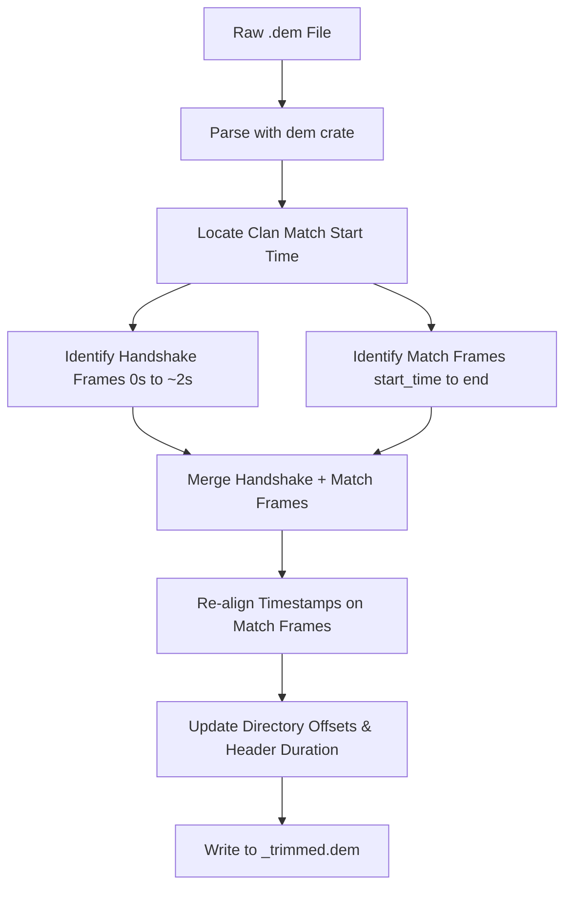

# 📋 Project Backlog & Future Improvements

This document tracks upcoming features, performance optimizations, and UI improvements for the Half-Life/Day of Defeat demo tools.

---

## ⚡ Task Board (Sorted by Difficulty)

Below is the consolidated backlog, structured as a clean, scannable table sorted from easiest to hardest with unique reference IDs and developer implementation notes.

| ID | Difficulty | Task | Area | Description | Dev Notes |
| :--- | :--- | :--- | :--- | :--- | :--- |
| **E1** | 🟢 **Easy** | **Scoreboard Columns Removal** | GUI / Scoreboard | Remove `"Avg. Life"`, `"Min. Life"`, and `"Max. Life"` columns to move them to a dedicated player details page later. | Remove corresponding `TableBuilder` column definitions and row value labels from `native/src/bin/gui/views/scoreboard.rs`. |
| **[x] E2** | 🟢 **Easy** | **Analyzer Version Relocation** | GUI / Summary | Relocate the `dod-tools` analyzer application version string out of the Summary tab and into the window title bar or a Help -> "About" menu. | *Completed:* Updated `native/src/bin/gui/main.rs` to format window title with package version and removed the grid row in `summary.rs`. |
| **[x] E3** | 🟢 **Easy** | **Chat Formatting: Square Brackets** | GUI / Chat Log | Format system announcements using square brackets (e.g., `[system]`) instead of round brackets `(system)`. | *Completed:* Changed `#app_chat_system_prefix` from `"(system)"` to `"[system]"` in the localization resources. |
| **[x] E4** | 🟢 **Easy** | **Chat Formatting: Spacing Trim** | GUI / Chat Log | Clean up extra padding and spaces (e.g., trim multiple spaces around nicknames and colons). | *Completed:* Refactored `chat.rs` layout spacing and trimming so nicknames have no spaces before colon and exactly one space after. |
| **E5** | 🟢 **Easy** | **Filter POV Engine Messages** | GUI / Chat Log | Suppress client/POV engine logging (like `"[07:48:88] (system) First Person"`) to declutter chat. | Filter out client-side system logs containing specific substrings (like `"First Person"` or `"Third Person"`) before adding to chat lists. |
| **E6** | 🟢 **Easy** | **Friendly Weapon Names** | GUI / UI Tables | Translate raw demo weapon identifiers (e.g., `Kabar`) to friendly names (e.g., `"Knife"`) for a polished user experience. | Create a weapon name localization mapping helper using translation keys or a simple match statement in `native/src/bin/gui/views.rs`. |
| **E7** | 🟢 **Easy** | **Double Listing Filenames Bug** | CLI / Auditor | Resolve the CLI issue where identical demo files occasionally print twice in audit summaries. | Check `scan_dir` in `hl-demo-auditor/src/lib.rs` for duplicate paths when recursively adding files to the audit list. |
| **M1** | 🟡 **Medium** | **Kill Streaks Dropdown Selection** | GUI / Streaks | Re-layout the Streaks tab to use a player-selection dropdown rather than cramming all players into nested collapsible lists. | Add a `ComboBox` select list for players. Use the selected player's global ID to filter and render only their streaks, replacing the current nested collapsing lists. |
| **M2** | 🟡 **Medium** | **Color-Coded Team Mentions** | GUI / Chat Log | Render team names in team colors (e.g. "Axis" in red, "Allies" in green) in system announcements. | Scan system messages for team names (`"Allies"`, `"Axis"`) and style those segments using custom egui labels with team colors in `chat.rs`. |
| **M3** | 🟡 **Medium** | **Chat Filter Logic Overlap** | GUI / Chat Log | Fix player filter toggles so that unchecking "Alive" and "Dead" doesn't permanently lock all chat channels. | Decouple the chat visibility filters in `chat.rs` so that unchecking `"Alive"` and `"Dead"` switches them to a default fallback state instead of fully hiding chat. |
| **M4** | 🟡 **Medium** | **Kill Streak Filters & Timings** | GUI / Streaks | Add streaks filtering (include/exclude weapons) and display millisecond intervals between kills. | Add filter checkboxes to analysis/GUI and calculate delta timestamps between sequential kill events inside each streak. |
| **M5** | 🟡 **Medium** | **ScoreInfo Message Syncing** | Parser / Core | Register `ScoreInfo` / `ScoreInfoLong` user messages in the `dod` parser to sync scoreboard data. | Add cases for `ScoreInfo` and `ScoreInfoLong` to the user message match lists in `analysis/src/lib.rs` and parser decoders in `dod/src/lib.rs`. |
| **M6** | 🟡 **Medium** | **Maximize Tab Space Layout** | GUI / Layout | Expand widget layouts to consume the full screen width and height since the side-by-side demo comparison panel is gone. | Adjust default widget widths/margins and `TableBuilder` Column configurations in `native/src/bin/gui/views/` to occupy 100% of the screen. |
| **M7** | 🟡 **Medium** | **WASM Translation Assets** | GUI / WASM | Embed translation catalogs (e.g. `dod_tools_english.txt`) inside compiled binaries to enable WebAssembly translation. | Use `include_str!("../localizations/dod_tools_english.txt")` to bundle the default catalog directly into the binary for WASM runtime access. |
| **M8** | 🟡 **Medium** | **Lock-Free Concurrent Lookups** | Core / UI Thread | Replace the localization wrapper's `Mutex` with a read-mostly `RwLock` or `ArcSwap` to prevent widget thread contention. | Refactor the translation cache in `analysis/src/lib.rs` to use `std::sync::RwLock` or `once_cell` instead of standard `Mutex` locks. |
| **M9** | 🟡 **Medium** | **POV Client Duplicate Protection** | CLI / Auditor | Use client headers/viewpoints rather than just file sizes/hashes so same-match POVs from different players aren't flagged as duplicates. | Extract POV player index/header metadata during audit scans and add them to the file uniqueness hash signature. |
| **M10** | 🟡 **Medium** | **Project Renaming** | Project / Core | Rename the repository to support a broader set of Half-Life mods (e.g., CS 1.6, Team Fortress Classic). | Perform workspace-wide search & replace of `"dod-tools"` to the new project identifier and rename root config/directories. |
| **H1** | 🔴 **Hard** | **Combine Weapon & POV Tabs** | GUI / Layout | Merge "Weapon Breakdowns" and "POV Analytics" into a player dropdown selector. Show extra POV stats with visual notes only when the POV player is chosen. | Merge `views/weapons.rs` and `views/pov.rs` into a unified player details view. Add dynamic checks to append the POV analytics grid when the POV player is active. |
| **H2** | 🔴 **Hard** | **Objective Capture Timelines** | Parser / GUI | Track flags captured (`CapMsg`) and interruptions (`CancelProg`) to display objective capture timelines. | Track `CapMsg` and `CancelProg` network messages in `analysis/src/lib.rs` and build a horizontal time-based timeline widget in the GUI. |
| **H3** | 🔴 **Hard** | **Objective Capture Timelines** | Parser / Core | Trace POV ammo box creation/pickup/decay timelines by decoding delta packet updates (`SvcDeltaPacketEntities`). | Parse `SvcPacketEntities` updates and `SvcDeltaPacketEntities` decoders in `analysis/src/lib.rs` to map `models/w_ammobox.mdl` lifetimes. |
| **H4** | 🔴 **Hard** | **Zero-Copy String Decoding** | Parser / Core | Refactor the binary parser to yield `Cow<'a, str>` string slices rather than allocating owned `String` instances. | Change `String` fields in `dod` user messages to `Cow<'a, str>` and propagate lifetime bounds throughout the nominal parser library. |
| **H5** | 🔴 **Hard** | **Streaming Demo Parser** | Parser / Core | Fork/rewrite `dem` to stream frames sequentially, reducing memory allocation footprint to $O(1)$. | Refactor the `dem` crate parser to run as an iterator yielding sequential frames rather than pre-allocating an entire vector of parsed frames. |
| **H6** | 🔴 **Hard** | **Vec Capacity Pre-allocation** | Parser / Core | Pre-allocate collections (rounds, chat logs) using size-based heuristics to minimize reallocation cycles. | Pre-allocate capacities on vectors (e.g. `Vec::with_capacity`) inside `analysis/src/lib.rs` state updates using demo file size scale factors. |
| **H7** | 🔴 **Hard** | **"Trim Demo(s)" Tool** | CLI / Core | Slice and trim out demo warmups/setup times (detailed spec below). | Implement the trimming specification (handshake capture, warmup frame pruning, directory rebuilding) in a CLI command. |

---

## 📋 Detailed Feature Specifications

### 1. "Trim Demo(s)" Tool [H7 - 🔴 Hard / High Effort]
Trim a Day of Defeat (GoldSrc) demo file (`.dem`) down to only the time a clan match is actually played, stripping out warmup/setup time to reduce file sizes.

> [!NOTE]
> A GoldSrc demo is a recording of network state updates. Simply slicing from the start of a match will delete initial server handshake packets, causing the client to crash on load.

#### Trimming Steps
1. **Match Start Detection**: Find the first round start event (`RoundStart` net message or when scores reset to 0-0). Note timestamp `T_start`.
2. **Handshake Preservation**: Identify initialization packets from the first 2 seconds (`0.0s <= time <= 2.0s`) like `SvcServerInfo`, `SvcUpdateStringTable`, and `SvcResourceList`.
3. **Gameplay Slicing**: Discard all frames between `2.0s` and `T_start`. Keep handshake frames and gameplay frames after `T_start`.
4. **Timestamp Re-alignment**: Subtract offset `T_offset = T_start - 2.0` from all frames after warmup to align them cleanly after handshake.
5. **Directory & Header Reconstruction**: Update `directory_offset`, directory entries, frame counts, and total duration, then write output.

> [!WARNING]
> **POV vs HLTV Demos**: POV demos contain personal console commands and client inputs, while HLTV contains director messages and camera slots. Timings must be validated on both architectures.
