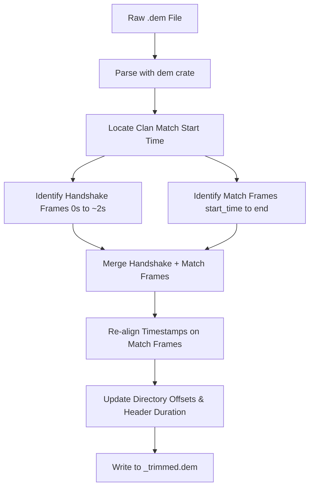

# 📋 Project Backlog & Future Improvements

This document tracks upcoming features, performance optimizations, and UI improvements for the Half-Life/Day of Defeat demo tools.

---

## ⚡ Active Task Board (Sorted by Difficulty)

Below are the remaining open tasks in the backlog, structured as a clean, scannable table sorted from easiest to hardest.

| ID | Difficulty | Task | Area | Description | Dev Notes |
| :--- | :--- | :--- | :--- | :--- | :--- |
| **E16** | 🟢 **Easy** | **WASM Worker Race Condition Fix** | GUI / WASM | Fix loading stall when drag-and-dropping demos on WebAssembly due to lost parse messages. | Implement a message-passing queue in the worker's JavaScript layer to buffer `parse` messages until WASM is ready. (See detailed spec below). |
| **E20** | 🟢 **Easy** | **Gitignore Diagnostic Files** | Project | Add `recent_commits.txt` to `.gitignore`. | Update `.gitignore` to ignore the transient `recent_commits.txt` file in the repository root. |
| **M10** | 🟡 **Medium** | **Project Renaming** | Project / Core | Rename the repository to support a broader set of Half-Life mods (e.g., CS 1.6, Team Fortress Classic). | Update workspace configuration files, Cargo declarations, settings paths, and cache files (e.g., `.dod-tools-cache.json`) to prevent breaking user settings and history. |
| **M11** | 🟡 **Medium** | **Server Mod Detection** | Parser / GUI | Detect common server-side mods (AMX/AMXX, Warcraft 3, Super Hero) present during a recorded demo and surface them in the UI. | Limit scanning to relevant console network frames (`TextMsg`, `HudText`, `Motd`) to avoid parsing overhead. Store as `Vec<DetectedMod>` on `AnalyzerState` and render in the Summary panel. |
| **M15** | 🟡 **Medium** | **Announce Round Cap-Outs in Chat** | GUI / Chat Log | Display team cap-out messages (e.g. "Axis Forces Have Capped Out") in the Chat Log tab. | Parse `#Game_Allies_Capped`, `#Game_Axis_Capped`, `#Game_Allies_Win`, and `#Game_Axis_Win` text messages in `analysis/src/chat.rs` and route them as `ChatType::System` announcements. |
| **M17** | 🟡 **Medium** | **Announce Flag Captures in Chat** | GUI / Chat Log | Add single-point and double-point flag capture events to the Chat Log. | Match flag capture event text templates (e.g., `#Game_captured_area`) in the `TextMsg` parser block to generate `[system]` chat entries without heavy network entity tracing. |
| **M20** | 🟡 **Medium** | **Score Reset Resiliency** | Parser / Core | Handle KTP league score updates at the start of the second half to prevent incorrect round-winner or score tracking. | Monitor `ResetHUD` and `ScoreInfo` updates mid-match to reset the analyzer's baseline scores when they drop back to 0-0. |
| **M21** | 🟡 **Medium** | **High-Quality / Colored Icons** | GUI / Layout | Replace the monochrome outline folder icons with colored vector outlines or custom colored images. | Implement Option B: style standard folder emoji labels with custom `egui::RichText` colors based on presence of demo files (e.g., sleek gray vs warm yellow). (See detailed spec below). |
| **M22** | 🟡 **Medium** | **Auto-Detect Game/Mod Localizations** | Core / GUI | Automatically locate and load language localization catalogs (`dod_*.txt`, `valve_*.txt`) from the user's local Steam or Half-Life installation when a demo folder is loaded. | Add search paths dynamically based on selected explorer directories, checking siblings and parent directories for game resources (e.g., `dod/resource` or `valve/resource`). (See detailed spec below). |
| **M23** | 🟡 **Medium** | **Premium UI Cards & Accent Tab Styling** | GUI / Layout | Restyle the GUI tabs and summary blocks to use modern metrics cards and colored underline active tab accents. | Redesign the tab headers and player overview cards using styled `egui::Frame` panels and draw active state underline strokes using egui painter. (See detailed spec below). |
| **M25** | 🟡 **Medium** | **Graceful Demo Corruption & High-Bit Flags Recovery** | Parser / Core | Handle corrupted frames or non-standard `0x800000` bitflags in network `message_length` fields instead of failing the entire parse. | Re-enable/refactor graceful parser frame-skipping inside `dem-patch/src/demo_parser.rs` or implement a parser mask/repair option. (See detailed spec below). |
| **M30** | 🟡 **Medium** | **Centralize Cache Path** | Core / OS | Replace the hardcoded relative `.dod-tools-cache.json` path with a centralized user profile directory (e.g., using the `dirs` crate for AppData/Local) to prevent duplicate caches when launching from different directories. | Update cached database loading and serializing to locate and create the config cache inside a central OS path structure. |
| **M31** | 🟡 **Medium** | **Extract POV Stats Tracking** | Parser / Core | Extract POV analytics state management from the monolithic `analysis/src/lib.rs` into `analysis/src/pov.rs`. | Move `use_pov_stats_updates` and `PovStats` into `analysis/src/pov.rs` to simplify core analysis orchestration loop. |
| **M32** | 🟡 **Medium** | **Deconstruct Player Details Tab Monolith** | GUI / Layout | Split the large `native/src/bin/gui/views/player_details.rs` into separate component files. | Move weapon grids rendering and killstreaks listing with filter checkboxes to `views/player_details/weapon_grid.rs` and `views/player_details/killstreaks.rs`. |
| **H1** | 🔴 **Hard** | **Combine Weapon & POV Tabs** | GUI / Layout | Merge "Weapon Breakdowns" and "POV Analytics" into a player dropdown selector. Show extra POV stats with visual notes only when the POV player is chosen. | Merge `views/weapons.rs` and `views/pov.rs` into a unified player details view. Add dynamic checks to append the POV analytics grid when the POV player is active. |
| **H2** | 🔴 **Hard** | **Objective Capture Timelines** | Parser / GUI | Track flags captured (`CapMsg`) and interruptions (`CancelProg`) to display objective capture timelines. | Track `CapMsg` and `CancelProg` network messages in `analysis/src/lib.rs` and build a horizontal time-based timeline widget in the GUI. |
| **H3** | 🔴 **Hard** | **Objective Capture Timelines** | Parser / Core | Trace POV ammo box creation/pickup/decay timelines by decoding delta packet updates (`SvcDeltaPacketEntities`). | Parse `SvcPacketEntities` updates and `SvcDeltaPacketEntities` decoders in `analysis/src/lib.rs` to map `models/w_ammobox.mdl` lifetimes. |
| **H4** | 🔴 **Hard** | **Zero-Copy String Decoding** | Parser / Core | Refactor the binary parser to yield `Cow<'a, str>` string slices rather than allocating owned `String` instances. | Change `String` fields in `dod` user messages to `Cow<'a, str>` and propagate lifetime bounds throughout the nominal parser library. |
| **H5** | 🔴 **Hard** | **Streaming Demo Parser** | Parser / Core | Fork/rewrite `dem` to stream frames sequentially, reducing memory allocation footprint to $O(1)$. | Refactor the `dem` crate parser to run as an iterator yielding sequential frames rather than pre-allocating an entire vector of parsed frames. |
| **H6** | 🔴 **Hard** | **Vec Capacity Pre-allocation** | Parser / Core | Pre-allocate collections (rounds, chat logs) using size-based heuristics to minimize reallocation cycles. | Pre-allocate capacities on vectors (e.g. `Vec::with_capacity`) inside `analysis/src/lib.rs` state updates using demo file size scale factors. |
| **H7** | 🔴 **Hard** | **"Trim Demo(s)" Tool** | CLI / Core | Slice and trim out demo warmups/setup times (detailed spec below). | Implement the trimming specification (handshake capture, warmup frame pruning, directory rebuilding) in a CLI command. |
| **H9** | 🔴 **Hard** | **Interactive Minimap & Player Positions** | GUI / Parser | Parse 3D player coordinates and project them onto a 2D minimap canvas overlaying map overview textures during playback. | Extract player origins from packet entities, map them using classic Half-Life map overview configurations, and draw them on a custom egui painter/canvas. (See detailed spec below). |
| **H10** | 🔴 **Hard** | **Automated Match Clustering** | Parser / GUI | Group demo files from the same match and half into hierarchical "Match Folders" in the UI using deep content fingerprinting, completely ignoring OS file dates. | Update local cache schema to include player_roster_hash and event_signature. Implement early-exit partial parsing to read headers/initial network messages. Update explorer.rs to render nested trees grouped by (map_name, server_ip, roster_hash). (See detailed spec below). |


---

## ✅ Completed Tasks

Below is a history of all successfully implemented and verified tasks.

| ID | Difficulty | Task | Area | Description | Dev Notes |
| :--- | :--- | :--- | :--- | :--- | :--- |
| **[x] E1** | 🟢 **Easy** | **Scoreboard Columns Removal** | GUI / Scoreboard | Remove `"Avg. Life"`, `"Min. Life"`, and `"Max. Life"` columns to move them to a dedicated player details page later. | *Completed:* Removed corresponding `TableBuilder` column definitions, headers, row labels, and sorting logic from `native/src/bin/gui/views/scoreboard.rs` while keeping the underlying stats in the backend Player model. |
| **[x] E2** | 🟢 **Easy** | **Analyzer Version Relocation** | GUI / Summary | Relocate the `dod-tools` analyzer application version string out of the Summary tab and into the window title bar or a Help -> "About" menu. | *Completed:* Updated `native/src/bin/gui/main.rs` to format window title with package version and removed the grid row in `summary.rs`. |
| **[x] E3** | 🟢 **Easy** | **Chat Formatting: Square Brackets** | GUI / Chat Log | Format system announcements using square brackets (e.g., `[system]`) instead of round brackets `(system)`. | *Completed:* Changed `#app_chat_system_prefix` from `"(system)"` to `"[system]"` in the localization resources. |
| **[x] E4** | 🟢 **Easy** | **Chat Formatting: Spacing Trim** | GUI / Chat Log | Clean up extra padding and spaces (e.g., trim multiple spaces around nicknames and colons). | *Completed:* Refactored `chat.rs` layout spacing and trimming so nicknames have no spaces before colon and exactly one space after. |
| **[x] E5** | 🟢 **Easy** | **Filter POV Engine Messages** | GUI / Chat Log | Suppress client/POV engine logging (like `"[07:48:88] (system) First Person"`) to declutter chat. | *Completed:* Filtered out client-side camera/spectator messages (`OBS_` and `Spec_Mode` logs) during parsing so they aren't stored in memory or shown. |
| **[x] E6** | 🟢 **Easy** | **Friendly Weapon Names** | GUI / UI Tables | Translate raw demo weapon identifiers (e.g., `Kabar`) to friendly names (e.g., `"Knife"`) for a polished user experience. | *Completed:* Created a `weapon_name` localization helper in `views.rs` mapping weapon variants to localized keys (Option B) with title-case fallback. |
| **[x] E7** | 🟢 **Easy** | **Double Listing Filenames Bug** | CLI / Auditor | Resolve the CLI issue where identical demo files occasionally print twice in audit summaries. | *Completed:* Canonicalized and deduplicated paths in `find_duplicates` to prevent identical files from being listed or processed twice. |
| **[x] E8** | 🟢 **Easy** | **Summary Durations Display** | GUI / Summary | Display total demo playback duration and active match play duration in the Summary tab. | *Completed:* Added `"Demo duration"` and `"Match duration"` lines to `summary.rs` using `humantime` formatting and made `current_time` in `AnalyzerState` public to calculate match length. |
| **[x] E9** | 🟢 **Easy** | **Summary Layout Restructuring** | GUI / Summary | Structure Summary tab into File, Demo, and Tech sections, split file path/name, and extract/render recorder's name. | *Completed:* Restructured `summary.rs` layout, split name/path, added section dividers, and captured HLTV proxy name when parser encounters HLTV slot update in `player.rs`. |
| **[x] E10** | 🟢 **Easy** | **Victim Column in Streaks** | GUI / Streaks | Add a "Victim" column to the kill streak breakdown table to show who was killed on each specific kill in a streak. | *Completed:* Integrated `PlayerGlobalId` of the victim in `KillStreak::kills`, implemented Option 2 layout combining Weapon + Victim name in streaks breakdown table, added scoreboard selection highlight sync, styled with team color and hand cursor, and updated CLI patterns. |
| **[x] M1** | 🟡 **Medium** | **Kill Streaks Dropdown Selection** | GUI / Streaks | Re-layout the Streaks tab to use a player-selection dropdown rather than cramming all players into nested collapsible lists. | *Completed:* Implemented `egui::ComboBox` dropdown synced with scoreboard row highlighting. |
| **[x] M2** | 🟡 **Medium** | **Color-Coded Team Mentions** | GUI / Chat Log | Render team names in team colors (e.g. "Axis" in red, "Allies" in green) in system announcements. | *Completed:* Implemented dynamic case-insensitive team pattern scan (supporting Allies, Allied, Axis, and Spectators) styling matching segments in their respective colors in `chat.rs`. |
| **[x] M4** | 🟡 **Medium** | **Kill Streak Filters & Timings** | GUI / Streaks | Add streaks filtering (include/exclude weapons) and display millisecond intervals between kills. | *Completed:* Added weapon filter checkboxes with Select All/Clear All options grouped by category (Grenades, Melee, Allied, Axis), and calculated/displayed millisecond intervals between sequential kills. |
| **[x] M12** | 🟡 **Medium** | **Kill/Death Counting Accuracy & Partial-Data UI Markers** | Parser / Core / GUI | Fix scoreboard stats for players who disconnect/rejoin and show partial-data/reconnect warnings. | *Completed:* Implemented Option D (Session Snapshot & Accumulation) to sum stats across reconnects. Added amber banner warning UI for demos started late/ended early showing exact boundary TimeLefts. Rendered player name markers 🔄 and * with rich tooltips for reconnects and pre-demo activity. |
| **[x] M13** | 🟡 **Medium** | **British Team Support** | Parser / GUI / Core | Add `Team::British` throughout the codebase. British maps are rare in clan matches but common on pub servers with custom maps. | *Completed:* Added `Team::British` variant, `Class::is_british()` helper, and dynamically promoted `Team::Allies` to `Team::British` in the analyzer state. Updated scoreboard, chat, weapons, timeline, and rounds formatting with British Gold/Yellow colors. |
| **[x] E11** | 🟢 **Easy** | **POV Analytics Border Style Fix** | GUI / Layout | Remove the unnecessary canvas frame border around the text details panel in the POV Analytics tab. | *Completed:* Removed the `egui::Frame::canvas` wrapping around the details grid in `native/src/bin/gui/views/pov.rs` to make it render cleanly without a contrasting background box. |
| **[x] E12** | 🟢 **Easy** | **Server Details in Summary** | GUI / Summary | Display the server name and IP address/port in the Summary tab for a quick reference on where the match was played. | *Completed:* Extracted the server name and address/IP/port from the demo's server info network messages, `SvcStuffText` commands, and `ConsoleCommand` frames, stored them in `AnalyzerState`, and displayed them in the Summary tab with a click-to-copy button. |
| **[x] E14** | 🟢 **Easy** | **Copy Filename & Open Folder** | GUI / Summary | Provide button icons in the Summary tab next to the filename and file path fields to easily copy the filename or open the directory. | *Completed:* Added small copy icons (`📋`) for filename and path, and a folder icon (`📁`) to open the parent folder in File Explorer on native targets. |
| **[x] M5** | 🟡 **Medium** | **ScoreInfo Message Syncing** | Parser / Core | Register `ScoreInfo` / `ScoreInfoLong` user messages in the `dod` parser to sync scoreboard data. | *Completed:* Registered `ScoreInfo` and `ScoreInfoLong` in `dod` message parser and integrated them into the analysis engine to sync stats, class, and team details. |
| **[x] M3** | 🟡 **Medium** | **Chat Filter Logic Overlap** | GUI / Chat Log | Fix player filter toggles so that unchecking "Alive" and "Dead" doesn't permanently lock all chat channels. | *Completed:* Decoupled the chat visibility filters in `chat.rs` so that unchecking `"Alive"` and `"Dead"` switches them to a default fallback state showing all messages instead of fully hiding chat. |
| **[x] E13** | 🟢 **Easy** | **Player Profile External Links** | GUI / Scoreboard | Add quick web links to popular profiling services (e.g. Legit-Proof, Steam Community) next to a player's ID on the scoreboard. | *Completed:* Consolidated external links (Steam profile and Legit-Proof) directly into the Player Details view. |
| **[x] E15** | 🟢 **Easy** | **Clean Up System Message Formatting** | Parser / Chat Log | Trim or clean up trailing newlines and raw console command arguments (like `"\nready2 3 4\n"`) from system announcements. | *Completed:* Implemented raw console command filtering and newline/whitespace normalization in system message translation, with associated tests. |
| **[x] M6** | 🟡 **Medium** | **Maximize Tab Space Layout** | GUI / Layout | Expand widget layouts to consume the full screen width and height since the side-by-side demo comparison panel is gone. | *Completed:* Adjusted default widget widths/margins and TableBuilder Column configurations in `native/src/bin/gui/views/` to occupy 100% of the screen. Centered the scoreboard view and bounded its width to 50% of the screen. |
| **[x] M14** | 🟡 **Medium** | **Group Scoreboard by Team** | GUI / Scoreboard | Remove the "Team" column from the scoreboard table and group players under separate Allies/British and Axis headings. | *Completed:* Removed the "Team" column from the scoreboard table and refactored `native/src/bin/gui/views/scoreboard.rs` to split the player list by team and render separate Allied/British and Axis headers and tables with total statistics. |
| **[x] M24a** | 🟡 **Medium** | **Automated Highlight Capture - Core & GUI** | CLI / GUI | Generate patched recording demos automatically for player killstreaks with custom timing and command configurations. | *Completed:* Implemented a WASM-compatible patch engine (`patch.rs`), `patch-streak` CLI subcommand, and interactive export GUI next to player killstreaks. Includes configurable settings for initial delay, fast-forward speed, pre/post record buffers, leads, trails, and automatic HLTV spectate locking (`spec_player` + `spec_mode 4`). |
| **[x] M7** | 🟡 **Medium** | **WASM Translation Assets** | GUI / WASM | Embed translation catalogs (e.g. `dod_tools_english.txt`) inside compiled binaries to enable WebAssembly translation. | *Completed:* Embedded translation catalogs in WebAssembly builds via macro bundling, fallback parsing, and runtime lazy loading. |
| **[x] M8** | 🟡 **Medium** | **Lock-Free Concurrent Lookups** | Core / UI Thread | Replace the localization wrapper's `Mutex` with a read-mostly `RwLock` or `ArcSwap` to prevent widget thread contention. | *Completed:* Replaced standard `Mutex` with `RwLock` on translation references in `analysis/src/localization.rs` to allow non-blocking concurrent UI thread lookups. |
| **[x] M16** | 🟡 **Medium** | **Robust Demo Type Guessing** | Parser / Core | Fix the issue where demo type (POV vs HLTV) is guessed on initial parse and then flips or changes after a full parse when clicked. | *Completed:* Implemented a persistent local `.dod-tools-cache.json` cache to persist type classifications and metadata matching modification times. |
| **[x] M18** | 🟡 **Medium** | **Demo List Search & Filtering** | GUI / Layout | Add filtering controls (by type, map, date range, search query) and a "Reset Filters" button above the demo list. | *Completed:* Integrated collapsible search and filter widgets with reset capabilities directly above the file tree. |
| **[x] M19** | 🟡 **Medium** | **Explorer Folder Collapsing State Fix** | GUI / Layout | Allow collapsing a folder in the Explorer tree even if the active file is a child of the folder being closed. | *Completed:* Modified expansion checks to capture active selection transitions, enabling manual folder collapsing. |
| **[x] M24b** | 🟡 **Medium** | **Highlight Capture - Smart Death Notice Clearing** | CLI / GUI / Parser | Inspect target player's recent deaths to delay `hud_deathnotice_time` pin commands, clearing their own death notices before recording. | *Completed:* Added player recent mortality checks to target first-kill ticks before enabling extended death notice durations. |
| **[x] M24c** | 🟡 **Medium** | **Highlight Capture - Batch Queue Automation** | CLI / GUI / Python | Support batch-exporting multiple selected killstreaks with sequential demo patching, automatic exit, and a Python queue sequencer. | *Completed:* Implemented background execution manager using tokio processes to automate highlight generation and output routing. |
| **[x] E17** | 🟢 **Easy** | **Persistent Folder History** | GUI / Explorer | Implemented persistent folder history and pinned folders. | *Completed:* Integrated configuration-backed pinned folder storage and recursive folder selection history within the Explorer UI. |
| **[x] E18** | 🟢 **Easy** | **Report UI Tab State Persistence** | GUI / Layout | Persisted report UI active tab state when switching between demos. | *Completed:* Modified tab navigation selection bindings in `main.rs` to persist the active workspace sub-tab during demo transitions. |
| **[x] E19** | 🟢 **Easy** | **Draft/Revert Configuration Buffers** | GUI / Settings | Implemented Draft/Revert Confirmation buffers to prevent aggressive disk I/O on slider edits. | *Completed:* Buffered general app configurations in a temporary `draft_settings` copy, writing to disk only upon explicit user confirmation. |
| **[x] M26** | 🟡 **Medium** | **Unified Capture Studio Dashboard** | GUI / Layout | Unified BatchMode and HLCR into a single 'Capture Studio' view tab. | *Completed:* Created a single unified view tab consolidating queue reviews, automated HLAE recordings, and HLCR rendering pipelines. |
| **[x] M27** | 🟡 **Medium** | **Dem Crate Patching** | Parser / Core | Fixed parsing panic by patching the dem crate with safe lookups. | *Completed:* Resolved index out of bound crashes within parsing sub-messages by applying custom boundary checks to the binary parser crate. |
| **[x] M28** | 🟡 **Medium** | **GitHub Pages Deployment Workflow** | Project / WASM | Implemented GitHub Pages deployment workflow and WASM alignment performance optimizations. | *Completed:* Automated WASM compilation and web hosting deployments via GitHub Actions workflows and refined allocation patterns. |
| **[x] M29** | 🟡 **Medium** | **Categorized Weapon Filters** | GUI / Streaks | Grouped weapon filters by category (Grenades, Melee, Allied, Axis) and added Select All/Clear All functionality. | *Completed:* Grouped weapon selection checkbox elements inside logical UI panels and introduced master toggles. |
| **[x] H11** | 🔴 **Hard** | **Process Manager Graceful Shutdown** | Core / Threading | Fix silent channel drop failures in `main.rs` to ensure spawned background processes (`hlae.exe`/`hl.exe`/`ffmpeg.exe`) are explicitly killed if the main GUI application is closed or the user aborts. | *Completed:* Secured HLAE and FFmpeg tokio tasks with a global `Arc<AtomicBool>` cancel flag, ensuring child processes are killed immediately on cancellation or when UI channels are dropped. |
| **[x] H8** | 🔴 **Hard** | **Background Threaded Demo Loading** | GUI / Threading | Prevent the GUI main thread from freezing when loading large demos. Move demo parsing to a background thread and report progress steps/percentage to the UI spinner/bar. | *Completed:* Implemented asynchronous background parsing pipelines with 30fps MPSC channel debouncing to eliminate UI freezing. |
| **[x] M33** | 🟡 **Medium** | **Modularize GUI Entrypoint (main.rs)** | GUI / Layout | Re-organize the monolithic 4,800+ line main.rs file into smaller self-contained modules without altering app behaviors. | *Completed:* Created types.rs, settings.rs, worker.rs, pipeline.rs, views/settings.rs, and views/capture_studio.rs. Cleaned up duplicate pipeline declarations, fixed settings.post_record_buffer field mismatch, and resolved unused target-specific imports. |
| **[x] M34** | 🟡 **Medium** | **HLCR Render Cancellation UI Fix** | GUI / HLCR | Fix the render cancellation logic so clicking 'x' immediately cancels queued or rendering rows and clicking 'Start Render' preserves the Cancelled status. | *Completed:* Removed the automatic reset of "Cancelled" jobs in `start_rendering`, added a `reset_job` row helper, and drew a Re-queue (🔄) button in the actions column for "Cancelled", "Finished", or "Error" rows. |

---

## 📋 Detailed Feature Specifications

### 1. "Trim Demo(s)" Tool [H7 - 🔴 Hard / High Effort]
Trim a Day of Defeat (GoldSrc) demo file (`.dem`) down to only the time a clan match is actually played, stripping out warmup/setup time to reduce file sizes.

> [!NOTE]
> A GoldSrc demo is a recording of network state updates. Simply slicing from the start of a match will delete initial server handshake packets, causing the client to crash on load.



#### Trimming Steps
1. **Match Start Detection**: Find the first round start event (`RoundStart` net message or when scores reset to 0-0). Note timestamp `T_start`.
2. **Handshake Preservation**: Identify initialization packets from the first 2 seconds (`0.0s <= time <= 2.0s`) like `SvcServerInfo`, `SvcUpdateStringTable`, and `SvcResourceList`.
3. **Gameplay Slicing**: Discard all frames between `2.0s` and `T_start`. Keep handshake frames and gameplay frames after `T_start`.
4. **Timestamp Re-alignment**: Subtract offset `T_offset = T_start - 2.0` from all frames after warmup to align them cleanly after handshake.
5. **Directory & Header Reconstruction**: Update `directory_offset`, directory entries, frame counts, and total duration, then write output.

> [!WARNING]
> **POV vs HLTV Demos**: POV demos contain personal console commands and client inputs, while HLTV contains director messages and camera slots. Timings must be validated on both architectures.

---

### 2. Kill/Death Counting Accuracy Across Reconnects [M12 - 🟡 Medium]

The scoreboard currently derives kill and death counts from server-sent absolute-total packets (`ScoreShort`, `Frags`, `ObjScore`). These are accurate as long as the server preserves a player's stats across a disconnect/reconnect — but **standard GoldSrc resets a player's server-side stats to zero on reconnect**, even if the Steam ID is the same.

#### The Problem

> **Example:** Player A gets 5 kills and 0 deaths, disconnects, rejoins, then gets 2 more kills and 3 deaths.
>
> - **Correct result:** 7 kills, 3 deaths
> - **Current result (if server resets on reconnect):** 2 kills, 3 deaths — because the post-reconnect `Frags` packet reports `frags=2` (server restarted from 0) and overwrites the preserved 5.

All individual kill and death events **are present in the demo file** as `DeathMsg` packets (broadcast to every client at the time of the kill), so the raw data is available to count correctly.

#### Root Cause

The analyzer stores stats as the last absolute value received from the server:

- `Frags.frags` → overwrites `player.stats.1` (kills)
- `ScoreShort.kills` → overwrites `player.stats.1` (kills)
- `ScoreShort.deaths` → overwrites `player.stats.2` (deaths)
- `ObjScore.score` → overwrites `player.stats.0` (score)

On reconnect, a new server-side session begins. The server sends a fresh `Frags` starting from 0, which silently discards the pre-disconnect counts stored on the local player record.

---

#### Option A — `DeathMsg`-only counting (independent accumulator)

**How it works:** Ignore `Frags`/`ScoreShort` for kills and deaths entirely. Add two new fields to `Player`: `kills_counted: u32` and `deaths_counted: u32`. Increment them on every `DeathMsg` where the player is killer or victim, resolved through the current slot-to-player mapping at the time each event fires.

**Pros:**
- Completely immune to server-side stat resets — counts every event in the demo regardless of reconnects.
- Simple, deterministic, easy to test.
- `DeathMsg` is already in the event pipeline and parsed.

**Cons:**
- **Wrong for mid-join demos.** If the recording starts partway through a match, all `DeathMsg` events before the recording began are missing. The counted kills/deaths for players who were already active will be understated.
- Ignores `Frags`/`ScoreShort` entirely, so any server-side corrections (e.g. admin-adjusted scores) are not reflected.
- Objective score still cannot be counted from events alone — there is no per-capture score-change packet — so `ObjScore` must still be used for `stats.0`.

**Verdict:** Best for full-game HLTV demos. Incorrect for partial recordings.

---

#### Option B — Server value as a floor, `DeathMsg` as a delta (hybrid)

**How it works:** On each `DeathMsg`, increment the independent counters (`kills_counted`, `deaths_counted`) as in Option A. On each `Frags`/`ScoreShort`, update the server-reported value. At display time, use `max(kills_counted, server_reported_kills)` as the displayed kill count, and likewise for deaths.

**Pros:**
- Handles the mid-join case: if you join mid-game, `ScoreShort` gives you the current totals as a baseline, and `DeathMsg` accumulates on top of whatever you caught.
- Still correct for full recordings where the server resets on reconnect, because the `DeathMsg` count grows above the reset server value.

**Cons:**
- `max()` is a heuristic — it assumes neither source under-counts, which is generally true but not guaranteed.
- Requires tracking two parallel kill/death counters per player.
- Edge cases: if a server admin manually reduces a player's score, the heuristic will ignore that reduction.

**Verdict:** Best overall balance. Handles both full recordings and mid-join demos without either source dominating incorrectly.

---

#### Option C — Seed from `ScoreShort` on first sync, accumulate `DeathMsg` deltas after

**How it works:** Track a `stats_seeded: bool` flag per player. On the first `ScoreShort`/`ScoreInfo` received after a player connects (or reconnects), set their kills/deaths to the server value and mark as seeded. After that point, use `DeathMsg` events as `+1` increments rather than overwriting with server values.

**Pros:**
- Correct for mid-join: the initial sync establishes the true baseline.
- Correct across reconnects: the `DeathMsg` delta accurately adds post-reconnect kills/deaths on top of the pre-disconnect total that was preserved on the local record.
- No heuristic — the logic is explicit.

**Cons:**
- Most complex to implement: requires per-player seeded state and per-connection session tracking.
- If the server sends a corrective `ScoreShort` after a legitimate stat adjustment, the code would ignore it (having already switched to delta mode).
- Reconnect detection must be reliable — the seeding must reset on each new connection event, not just the first one ever.

**Verdict:** Most accurate approach but requires the most careful state management.

---

#### Data Model Changes Required (all options)

```rust
// In Player struct (analysis/src/player.rs)
pub kills_counted: u32,    // incremented by DeathMsg (killer)
pub deaths_counted: u32,   // incremented by DeathMsg (victim)
// Option C only:
pub kills_seeded: bool,
pub deaths_seeded: bool,
```

`DeathMsg` is already parsed and available in the event stream. The handler in `analysis/src/scoreboard.rs` would need a new arm resolving both `killer_client_index` and `victim_client_index` to their current player records and incrementing the respective counters.

Objective score (`stats.0`) is not addressable by any per-event packet and must continue to come from `ObjScore`/`ScoreShort` regardless of the chosen option.

---

> [!IMPORTANT]
> **Confirmed:** DoD 1.3 resets a player's score, kills, and deaths to zero on reconnect server-side. Post-reconnect `Frags` and `ScoreShort` packets start from 0 and will overwrite the pre-disconnect counts stored on the local player record. The current code **does show incorrect stats** for players who disconnect and rejoin.
>
> **Also confirmed:** The demo file *does* contain all individual `DeathMsg` packets from the entire session — both before and after the reconnect — so the raw data to count correctly exists. There is no server packet that carries a "cumulative total including pre-disconnect" value; the only reliable source is counting `DeathMsg` events independently.
>
> **Chosen Approach: Option D** (Session Snapshot & Accumulation with Drop Detection). It dynamically aggregates stats across sessions when a reconnection drop is detected, while correctly bypassing aggregation on servers that naturally preserve/restore stats on reconnect. It also handles custom admin score changes and objective score updates accurately.

---

### 3. British Team Support [M13 - 🟡 Medium]

DoD 1.3 supports three playable factions: **Allies (US)**, **Axis (German)**, and **British**. British is a third team used on certain custom maps in pub play (e.g., `dod_anzio`, `dod_jagd`, British-themed maps). It is almost never seen in clan matches but needs to be handled correctly for pub demos.

#### Current State

The `Team` enum in `dod/src/lib.rs` has only:
```rust
pub enum Team { Allies, Axis, Spectators, Unassigned }
```

The `Class` enum **already** has `BritishRifleman` and `BritishMortar` variants, confirming the parser is aware British classes exist. However, there is no `Team::British` variant, so British players are silently mis-assigned.

In `dod/src/lib.rs`, team assignment from network messages comes from a numeric value (`1 = Allies`, `2 = Axis`, ...). The British team value needs to be identified from protocol (likely `3` or another value) and mapped.

#### Impact Without Fix

- British players appear under Allies or Unassigned on the scoreboard
- `team_sort_rank()` in `scoreboard.rs` has no British case — sort order is wrong
- `scoreboard.rs` `team_name()` has no British arm — name displays as Unknown
- `weapons.rs` weapon breakdown does not bucket British players separately
- `timeline.rs` score timeline only plots Allies/Axis — British team score is invisible
- `chat.rs` colour-coding doesn't highlight "British" team mentions
- `clan_match.rs` and `round.rs` team win detection ignores British rounds

#### Files to Update

| File | Change Required |
|---|---|
| `dod/src/lib.rs` | Add `Team::British` variant; map correct numeric value in team parser |
| `analysis/src/scoreboard.rs` | Add `Team::British => 2` (or appropriate rank) in team sort |
| `analysis/src/round.rs` | Add `BritishWin` round state handling if applicable |
| `analysis/src/lib.rs` | Add British team score tracking in `TeamScores` |
| `native/src/bin/gui/views/scoreboard.rs` | Add `Team::British` to `team_name()` and `team_sort_rank()` |
| `native/src/bin/gui/views/chat.rs` | Add British colour (e.g., `Color32::from_rgb(255, 200, 0)` — gold/yellow) and "British" pattern scan |
| `native/src/bin/gui/views/weapons.rs` | Add British weapon breakdown column |
| `native/src/bin/gui/views/timeline.rs` | Plot British team score line |
| `native/src/bin/gui/views/rounds.rs` | Add British team colour/name in round winner display |
| `native/src/bin/gui/views/streaks.rs` | Add `Team::British => BRITISH_COLOR` in any team-colour rendering |
| `localizations/dod_tools_english.txt` | Add `#teamname_british` key |

---

### 4. Background Threaded Demo Loading & Progressive Progress [H8 - 🔴 Hard]

Currently, clicking a demo file in the Explorer list blocks the egui main thread (single-threaded UI event loop) during the binary parsing phase. This causes the UI to freeze temporarily, and the loading spinner appears static rather than animating smoothly. Furthermore, there is no progressive feedback regarding the phase of loading.

#### Proposed Architecture
To resolve this, we will move demo loading to a background worker thread. Egui's thread needs to receive updates of the current phase and progress as it reads the demo bytes.

1. **Progress Channel**: Use a multi-producer, single-consumer channel (`std::sync::mpsc::channel`) or a crossbeam channel to send progress updates from the parser.
2. **Progress Message Enum**:
   ```rust
   pub enum ProgressUpdate {
       Phase(String, f32), // Phase description (e.g. "Parsing frames"), progress percent (0.0 to 1.0)
       Complete(Box<Analysis>),
       Error(String),
   }
   ```
3. **Background Worker**:
   - On native: Spawn a standard thread or a tokio task to run the parser.
   - On WASM: Use web workers or future-based promises with `wasm_bindgen_futures::spawn_local` since browser threads are restricted.
4. **UI Thread Poll**: The UI checks the receiver end of the channel on every frame (using `request_repaint()` to ensure the event loop runs continuously while loading). The loading overlay renders the actual phase message and matches the progress bar's percentage state.

---

### 5. Robust Demo Type Identification & Caching [M16 - 🟡 Medium]

Currently, the file explorer uses a simple heuristic to guess the demo type prior to parsing (specifically: if the filename contains "hltv", it is classified as "HLTV", otherwise "POV"). Once selected, the full parser runs, detects the true demo type by checking network structure, and updates the state. This causes visual flipping or twitching in the explorer list (e.g. a file named `axis-vs-allies.dem` starting as "POV" and suddenly changing to "HLTV").

#### Recommended Approach: Local Metadata Caching (Option B)
Introduce a persistent local cache file (e.g., `.dod-tools-cache.json` or a SQLite database in the app data folder) storing resolved metadata (filename, map, type, duration) for scanned files.
- When scanning the directory, if a file's modification time matches the cache entry, read metadata from the cache instantly.
- If it is a cache miss, queue the file for a background scan, then write back to the cache. This ensures fast load times and persistent, correct classifications.
- Avoid Option A (Initial scan of files on directory list) because scanning hundreds of files on the main explorer listing would block the UI thread during file dialogs.

---

### 6. High-Quality Colored Icons in egui [M21 - 🟡 Medium]

Currently, folder icons (`📁` and `📂`) render as white monochrome vector outlines because `egui` does not load color/bitmap system emoji fonts natively. To make the folder tree visual layout feel premium, we can implement high-quality colorized folder icons.

#### Recommended Approach: Colorized Monochrome Icons via RichText (Option B)
Instead of embedding complex external PNG/SVG textures, style standard characters/icons directly with explicit colors using `egui::RichText`.
1. **Dynamic Styling**: Draw the labels with explicit text colors using `egui::RichText` based on the status of the folder:
   - Regular empty folder: `RichText::new("📁").color(Color32::from_rgb(120, 120, 120))` (sleek gray).
   - Folder containing demos: `RichText::new("📂").color(Color32::from_rgb(250, 190, 50))` (vibrant warm yellow).
2. This approach is zero-overhead, compile-time safe, and highly portable between WebAssembly (WASM) and Native platforms.

---

### 7. Explorer Folder Collapsing State Fix [M19 - 🟡 Medium]

#### The Problem
In [explorer.rs](file:///d:/Repos/dod-tools/native/src/bin/gui/explorer.rs#L283-L293), the directory tree renderer checks if the currently active path resides under a folder node (`is_ancestor`). If true, it overrides the collapsing header state:
```rust
if is_ancestor {
    state.set_open(true);
    state.store(ui.ctx());
}
```
This runs on **every single frame**, making it impossible for a user to collapse parent folders of the active file—any manual collapse is immediately overwritten and snapped open on the subsequent frame.

#### Resolution Steps
1. Add a tracking field to the GUI state in `main.rs` (e.g., `last_selected_path: Option<PathBuf>`).
2. When drawing the tree, only apply `state.set_open(true)` if `last_selected_path` has just changed (a selection transition).
3. Once the initial auto-expansion runs, do not force the state open on subsequent frames, enabling full manual collapse.

---

### 8. WASM Translation Assets [M7 - 🟡 Medium]

#### The Problem
Currently, the translation engine in `analysis/src/localization.rs` performs file-system directories scanning to load localization files. On WASM builds (`target_arch = "wasm32"`), disk IO is unsupported, returning an empty translation map.

#### Resolution Steps
1. Bundle all key translation catalogs (`dod_tools_english.txt`, `dod_english.txt`, `gameui_english.txt`, and `valve_english.txt`) from the `/localizations` directory directly using `include_str!`.
2. Wrap the assets initialization inside target conditional checks:
   ```rust
   #[cfg(target_arch = "wasm32")]
   fn load_localizations_from_disk(_active_lang: &str) -> HashMap<String, String> {
       // Parse embedded strings instead of reading from disk
   }
   ```
3. Use a static/lazy initialization step to parse the embedded strings when the application is launched.

---

### 9. Lock-Free Concurrent Lookups [M8 - 🟡 Medium]

#### The Problem
In `analysis/src/localization.rs`, lookups are protected by standard `Mutex` locks. During UI rendering, translation lookup (`t(...)`) is called multiple times per widget per frame, causing potential lock contention and UI micro-stutters.

#### Resolution Steps
1. Refactor `LOCALIZATIONS` to use a `std::sync::RwLock` wrapping the `Option<HashMap<String, String>>`.
2. This allows multiple concurrent reader threads (e.g., parallel rendering or background parsing) to perform lookups concurrently.
3. When the user changes active languages via UI, acquire a write lock to flush/reset the `HashMap`. Do not use `OnceLock` because `OnceLock` values are immutable and cannot be cleared.

---

### 10. Auto-Detect Game/Mod Localizations [M22 - 🟡 Medium]

#### The Problem
Currently, localizations are loaded only from relative paths within the application's directory (`localizations` or `../localizations`). If a user has a localized game installed in a custom Steam directory, they would have to manually configure or map their mod folders to see localized text for their language.

#### Resolution Steps
1. Extend the localization loading API in `analysis/src/localization.rs` to allow dynamically adding directory paths.
2. In the GUI explorer or main event handler, when a user selects a demos directory:
   - Check if that directory contains a `resource` folder (e.g., `dod/resource`).
   - Traverse up parent directories to locate a `Half-Life` root directory.
   - If found, automatically append the resource folders for `valve` and `dod` (e.g., `Half-Life/valve/resource/` and `Half-Life/dod/resource/`) to the localization search path list.
3. Trigger a cache flush and reload (`set_active_language(get_active_language())`) using the updated path registry.

---

### 11. Premium UI Cards & Accent Tab Styling [M23 - 🟡 Medium]

#### The Problem
The current GUI tabs and layout render as basic text/labels with standard borders, failing to reflect the high-quality dashboard aesthetics generated in design mockups (e.g., `gui_dashboard.png`). The interface requires a more premium theme with visual hierarchy and active indicator styling.

#### Resolution Steps
1. **Metric Cards**: Refactor player stats and summary summaries into visual blocks:
   - Use `egui::Frame` with round corner radius (`corner_radius(6.0)`), inner margins (`inner_margin(12.0)`), custom background fills (`bg_fill(Color32::from_rgb(26, 26, 26))`), and accent outline strokes.
   - Group information inside horizontal rows with clear headers and larger font displays for key metrics (Score, Kills, Deaths).
2. **Active Underline Tabs**:
   - Instead of standard buttons, draw the navigation tab strip using a custom layout.
   - For the active tab, paint a thin horizontal accent line (in theme/team color) along the bottom margin of the tab label using `ui.painter().line(...)` after determining the label's bounding box (`rect`).

---

### 12. Interactive Minimap & Player Positions Playback [H9 - 🔴 Hard / High Effort]

#### The Problem
The dashboard mockup (`gui_dashboard.png`) includes a minimap showing live player positions. The application currently has no geospatial overview of the match.

#### Technical Feasibility & Implementation
1. **Data Parsing**:
   - Player 3D coordinates (origins) are present in network frame entities (`SvcPacketEntities` and `SvcDeltaPacketEntities`).
   - We must extend the parsing loop in `dod` and `analysis` to record players' `(x, y, z)` origins for each frame tick, keeping them in a frame-indexed player lookup table in the `Analysis` structure.
2. **2D Projection (Overview Files)**:
   - GoldSrc maps specify 2D projections in `overviews/<map_name>.txt` configs (e.g., `dod_anzio.txt`):
     - `zoom <f32>` (scale factor)
     - `origin <x> <y> <z>` (coordinate offset representing map center)
   - Map `(x, y)` game coordinates to `(u, v)` 2D coordinates on a canvas:
     - $u = \text{center\_x} + \frac{x - \text{origin\_x}}{\text{zoom}}$
     - $v = \text{center\_y} - \frac{y - \text{origin\_y}}{\text{zoom}}$
3. **Overview Texture Rendering**:
   - Load the overview background map PNG/BMP into an `egui::TextureHandle`.
   - Native builds can read this dynamically from the game's `overviews/` directory.
   - WASM builds cannot access the local filesystem, so they must use a placeholder grid or attempt to fetch maps from a public remote repository over HTTPS.
4. **Drawing and Playback Control**:
   - Draw the overview image inside a custom egui canvas widget.
   - Iterate through active player positions for the selected frame index, painting colored dots (Allies/British vs. Axis) with short nickname tags on top of the image.
   - Implement playback controls (Play, Pause, Speed Slider) linked to the timeline widget.

---

### 13. WASM Worker Race Condition Fix [E16 - 🟢 Easy]

#### The Problem
When dragging and dropping a demo file on WebAssembly, the application hangs indefinitely showing `Loading and preparing... (Elapsed: 0.0s)`. This happens because:
1. `get_or_spawn_worker` creates the Web Worker and immediately posts the `init` message.
2. Right after, `parse_bytes_via_worker` posts the `parse` message.
3. The worker is still asynchronously importing and compiling the WASM module. During this compilation phase, its initial JavaScript listener intercepts the `parse` message, does not recognize it, and discards it.
4. Once WASM compilation finishes, it calls `wasm_bindgen.init_worker()` which registers the new message listener, but the `parse` message has already been lost.

#### Technical Feasibility & Implementation
Refactor `native/src/bin/gui/main.rs` to keep the worker's main `onmessage` dispatcher in the JavaScript layer, buffering/queuing messages until WASM is fully initialized:

1. **Update `init_worker` and add `handle_worker_message`** in Rust:
```rust
#[cfg(target_arch = "wasm32")]
#[wasm_bindgen]
pub fn init_worker() {
    console_error_panic_hook::set_once();
}

#[cfg(target_arch = "wasm32")]
#[wasm_bindgen]
pub fn handle_worker_message(data: wasm_bindgen::JsValue) {
    let global = js_sys::global();
    let post_message = js_sys::Reflect::get(&global, &"postMessage".into())
        .unwrap()
        .dyn_into::<js_sys::Function>()
        .unwrap();
        
    let type_val = js_sys::Reflect::get(&data, &"type".into())
        .unwrap()
        .as_string()
        .unwrap_or_default();
        
    if type_val == "parse" {
        let path = js_sys::Reflect::get(&data, &"path".into())
            .unwrap()
            .as_string()
            .unwrap_or_default();
        let name = js_sys::Reflect::get(&data, &"name".into())
            .unwrap()
            .as_string()
            .unwrap_or_default();
        let last_modified = js_sys::Reflect::get(&data, &"lastModified".into())
            .unwrap()
            .as_f64()
            .unwrap_or(0.0);
        let size = js_sys::Reflect::get(&data, &"size".into())
            .unwrap()
            .as_f64()
            .unwrap_or(0.0);
            
        let bytes_val = js_sys::Reflect::get(&data, &"bytes".into()).unwrap();
        let uint8_array = js_sys::Uint8Array::new(&bytes_val);
        let bytes = uint8_array.to_vec();
        
        let path_clone = path.clone();
        let post_message_clone = post_message.clone();
        let start_time = web_time::SystemTime::now();
        
        let progress_cb = move |processed: usize, total: usize| {
            if total > 0 {
                let progress = processed as f32 / total as f32;
                let elapsed_sec = start_time.elapsed().map(|d| d.as_secs_f32()).unwrap_or(0.0);
                let eta_sec = if progress > 0.01 {
                    let total_estimated_sec = elapsed_sec / progress;
                    Some(total_estimated_sec - elapsed_sec)
                } else {
                    None
                };
                
                let progress_obj = js_sys::Object::new();
                js_sys::Reflect::set(&progress_obj, &"type".into(), &"progress".into()).unwrap();
                js_sys::Reflect::set(&progress_obj, &"path".into(), &path_clone.clone().into()).unwrap();
                js_sys::Reflect::set(&progress_obj, &"progress".into(), &progress.into()).unwrap();
                js_sys::Reflect::set(&progress_obj, &"elapsedSec".into(), &elapsed_sec.into()).unwrap();
                if let Some(eta) = eta_sec {
                    js_sys::Reflect::set(&progress_obj, &"etaSec".into(), &eta.into()).unwrap();
                }
                
                let _ = post_message_clone.call1(&js_sys::global(), &progress_obj);
            }
        };
        
        match Analysis::try_from_bytes_with_progress(&bytes, progress_cb) {
            Ok(analysis) => {
                if let Ok(serialized) = serde_json::to_string(&analysis) {
                    let success_obj = js_sys::Object::new();
                    js_sys::Reflect::set(&success_obj, &"type".into(), &"success".into()).unwrap();
                    js_sys::Reflect::set(&success_obj, &"path".into(), &path.into()).unwrap();
                    js_sys::Reflect::set(&success_obj, &"name".into(), &name.into()).unwrap();
                    js_sys::Reflect::set(&success_obj, &"lastModified".into(), &last_modified.into()).unwrap();
                    js_sys::Reflect::set(&success_obj, &"size".into(), &size.into()).unwrap();
                    js_sys::Reflect::set(&success_obj, &"analysisJson".into(), &serialized.into()).unwrap();
                    
                    let _ = post_message.call1(&js_sys::global(), &success_obj);
                } else {
                    let error_obj = js_sys::Object::new();
                    js_sys::Reflect::set(&error_obj, &"type".into(), &"error".into()).unwrap();
                    js_sys::Reflect::set(&error_obj, &"path".into(), &path.into()).unwrap();
                    js_sys::Reflect::set(&error_obj, &"error".into(), &"Failed to serialize Analysis".into()).unwrap();
                    
                    let _ = post_message.call1(&js_sys::global(), &error_obj);
                }
            }
            Err(err) => {
                let error_obj = js_sys::Object::new();
                js_sys::Reflect::set(&error_obj, &"type".into(), &"error".into()).unwrap();
                js_sys::Reflect::set(&error_obj, &"path".into(), &path.into()).unwrap();
                js_sys::Reflect::set(&error_obj, &"error".into(), &err.into()).unwrap();
                
                let _ = post_message.call1(&js_sys::global(), &error_obj);
            }
        }
    }
}
```

2. **Update the worker JS setup** in `get_or_spawn_worker`:
```rust
        let blob_code = format!(
            r#"
            let wasm_bindgen = null;
            let wasm_promise = null;
            let pending_messages = [];

            self.onmessage = async function(e) {{
                const data = e.data;
                if (data && data.type === 'init') {{
                    if (wasm_promise) return;
                    wasm_promise = (async () => {{
                        try {{
                            wasm_bindgen = await import(data.jsUrl);
                            await wasm_bindgen.default(data.wasmUrl);
                            wasm_bindgen.init_worker();
                            self.postMessage({{ type: 'ready' }});
                            for (const msg of pending_messages) {{
                                wasm_bindgen.handle_worker_message(msg);
                            }}
                            pending_messages = [];
                        }} catch (err) {{
                            self.postMessage({{ type: 'error', error: err.toString() }});
                        }}
                    }})();
                } else {{
                    if (wasm_bindgen) {{
                        wasm_bindgen.handle_worker_message(data);
                    }} else {{
                        pending_messages.push(data);
                    }}
             }};
             "#
         );
 ```

### 14. Programmatic Demo Movie Recording Commands Injector (HLAE / -demoedit)

For movie makers running Day of Defeat 1.3 (or other GoldSrc mods) with HLAE, manually adding events with `-demoedit` is a tedious process. Programmatically injecting console commands directly into the demo files (`.dem`) offers a much faster workflow.

#### Mechanics

1. **`ConsoleCommand` Frames**: The GoldSrc demo parser handles console commands through `ConsoleCommand` frames (type `3`).
2. **Execution Timing (`playdemo` vs `viewdemo`)**: 
   - **`playdemo` is highly recommended** for this automation loop. It functions as a pure sequential stream reader.
   - Unlike `viewdemo`, `playdemo` completely ignores the demo's directory index at the end of the file. This means if directory byte alignment or offsets are off, `playdemo` will still read and play the file perfectly, bypassing engine index-read crashes.
3. **HLAE & Speed Automation**: To skip "dead zones" between highlights, the tool automates speed transitions. In GoldSrc, `host_framerate` controls time advancement per rendered frame:
   - `host_framerate 0` runs the game in real-time (normal speed).
   - `host_framerate 1` advances one second of game time per frame (extreme fast-forward).
   However, because GoldSrc's audio buffer desyncs when shifting speeds, we must drop speed back to real-time prior to recording to let the audio engine settle.

#### The Automation Loop

For each target highlight interval `[start_time, stop_time]`:
- **Initial Setup (Playback Start)**: Inject `host_framerate 1` (fast-forward).
- **Pre-Streak Normalization (`start_time - 4.0s`)**: Inject `host_framerate 0` to drop back to real-time speed. This gives the game engine 2 full seconds of normal playback to flush audio desyncs and catch up.
- **Record Start (`start_time - 2.0s`)**: Inject `mirv_recordmovie_start` to start capturing.
- **Record Stop (`stop_time + 2.0s`)**: Inject `mirv_recordmovie_stop` to stop capturing.
- **Post-Streak Fast-Forward (`stop_time + 2.1s`)**: Inject `host_framerate 1` to resume fast-forwarding to the next interval.

#### Batch Capture & Process Manager

GoldSrc has legacy memory allocation limits that make it prone to crashes when multiple demos are "daisy-chained" in a single session. To capture multiple demos safely, use a Process Manager workflow:
1. Pass the `--quit` or `-q` flag to the patch script. This will automatically append a `quit` command 0.5s after the final recording stop event.
2. Write a wrapper script (e.g. Python or PowerShell) to sequentially launch the game via HLAE using the command-line options, waiting for each instance to shut down before launching the next:
   ```python
   # Python sequential launcher using HLAE
   import subprocess
   
   hlae_exe = r"C:\Path\To\HLAE\hlae.exe"
   game_exe = r"C:\Program Files (x86)\Steam\steamapps\common\Half-Life\hl.exe"
   
   for demo in ["capture_01", "capture_02"]:
       args = [
           hlae_exe,
           "-afxHookGoldSrc",
           "-noGui",
           "-autoStart",
           "-gamePath", game_exe,
           "-modification", "dod",
           "-customCmdLine", f"-demoedit +playdemo {demo}"
       ]
       subprocess.run(args)
   ```

#### Patch Script (`scratch/debug.rs`)

A compiled utility is located at [debug.rs](file:///d:/Repos/dod-tools/scratch/debug.rs) to handle parsing, frame injection, time sorting, frame re-indexing, and writing back the patched `.dem` file.

To run the script:
```powershell
cargo run --release --bin debug_script <input_demo_path> <output_demo_path> <start_time_1> <stop_time_1> [<start_time_2> <stop_time_2> ...] [--quit | -q]
```

---

### 15. Automated Highlight Capture Generator [M24 - 🟡 Medium]

Build a feature that allows users to export automated HLAE capture demos directly from the analyzed killstreaks within the UI or CLI.

#### Phased Implementation Breakdown

1. **Step 1: The Core Engine (Headless CLI Subcommand)**
   - Build a foundational command-line interface subcommand in `native` (without GUI components) to run and test the binary injector.
   - Automatically locate the start and stop game-times of a player's killstreak from the analyzer, translate them to frame times (`real_offset` to `frame.time`), calculate lead-in/lead-out buffers, and inject basic commands (`host_framerate 1`/`0`, `mirv_recordmovie_start`/`stop`).
   - Export to a new `.dem` file.

2. **Step 2: The Custom Command Framework & GUI Integration**
   - Add an "Export Capture Demo" button next to player killstreak items in the **Streaks** tab of the GUI.
   - Build a settings dialog to let users define custom console commands for "Recording" states (e.g. `r_decals 5555; hud_draw 1`) and "Fast-Forwarding" states (e.g. `r_decals 0; hud_draw 0`).
   - Inject these custom command strings into the exported demos at the corresponding speed transition events.

3. **Step 3: The Death Notice Logic (Clearing Pre-Streak Spills)**
   - Detect if the target player died within 5.0 seconds before the start of the killstreak (standard GoldSrc death notice fade time).
   - If they did, delay the injection of custom long-lasting death notice commands (e.g., `hud_deathnotice_time 5555`) until exactly 1 tick before their *first* kill of the streak, allowing prior death notifications to clear.

4. **Step 4: The Automation Queue (Sequential Capture Launcher)**
   - Support batch exporting all killstreaks above a certain length to a series of capture demos (e.g., `capture_01.dem`, `capture_02.dem`, etc.) and automatically inject a `quit` command 0.5s after the final stop record event.
   - Write a helper Python script (`capture_queue.py`) using `subprocess` to launch the game sequentially, run each demo via `playdemo`, and terminate on exit.

#### Testing Plan

---

### 16. Graceful Demo Corruption & High-Bit Flags Recovery [M25 - 🟡 Medium]

Demos from certain sources or recorded under specific conditions (e.g., HLTV proxies, custom servers, or with network glitches) can contain corrupted frames or non-standard flags in network message frames.

#### Findings & Diagnostics
In the demo `icyvsdiceanziohalf1.dem`, parsing fails at Playback frame `14843` (offset `2433784`) because the network `message_length` field is read as `8388709` (`0x00800065`):
- The `0x800000` bit is set in the 32-bit length field.
- If masked using `message_length & 0x7FFFFF`, the length yields exactly `101` bytes.
- However, when limiting the payload to `101` bytes, parsing succeeds for the first few sub-messages (e.g. `SvcTime` and `SvcClientData`) but then encounters an `Eof` error on a subsequent message (`247`), indicating that the payload is actually longer or structured differently (e.g. split/compressed or offset by custom engine commands).
- Leaving the unmasked `8388709` length triggers the parser's safety check (`message_length > 65536`), which immediately aborts.

#### Options for Future Implementation

1. **Option A: Graceful Parser Abort & Partial Load**
   Refactor [demo_parser.rs](file:///d:/Repos/dod-tools/dem-patch/src/demo_parser.rs) to handle frame parsing errors within the directory entry parser loop gracefully. Instead of propagating the error via `?` (which fails the entire demo analysis), the loop breaks and returns all frames successfully parsed up to that point:
   ```rust
   loop {
       let (end_current_frame, frame) = match parse_frame(frames_start, netmsg_parse_mode, aux.clone()) {
           Ok(r) => r,
           Err(_) => break, // Gracefully yield frames parsed so far
       };
       // ...
   }
   ```
   *Pros*: Allows loading and visualizing the majority of a partially corrupt demo in the GUI (e.g. 14,843 frames parsed out of a 15,000 frame playback).
   *Cons*: Might mask underlying bugs in the parser or display incomplete metrics.

2. **Option B: Strict Validation & User Repair Flow (Current Preference)**
   Keep the strict validation intact to ensure data integrity. When a parsing error occurs, surface a clean, specific error in the UI identifying the corrupted frame index, and offer a tool to "Repair/Sanitize" or "Trim" the demo file by truncating it at the last known safe offset.
### 17. Automated Match Clustering Engine [H10 - 🔴 Hard]

#### The Problem
When players download team POV and HLTV demos from discord/web, Windows overrides the file creation/modification dates (mtime) with the download time. Grouping files via temporal metadata fails entirely. This results in a messy, flat Explorer UI list where finding synchronized files from a single match is highly tedious for movie makers.

#### Resolution Strategy: Deep Content Fingerprinting
Abandon filesystem dates. Cluster demos by analyzing the immutable game data embedded early in the binary stream. If multiple files share the exact same Map, Server IP, Player Roster, and Kill Event Sequence, they are mathematically proven to be from the exact same match.

#### Technical Implementation Steps

1. **Update the Cache Schema (`native/src/bin/gui/cache.rs` or core)**
   Modify the `DemoMetadata` struct that serializes to `.dod-tools-cache.json` to store content fingerprints rather than timestamps:
   ```rust
   #[derive(Serialize, Deserialize, Clone, Debug)]
   pub struct DemoMetadata {
       pub file_path: PathBuf,
       pub map_name: String,
       pub server_ip: String,
       pub demo_type: DemoType, // POV vs HLTV
       pub player_roster_hash: u64, // SipHash/AHash of the sorted array of active SteamIDs
       pub event_signature: Vec<String>, // Array of the first 10 DeathMsg strings (e.g., ["id1>id2:weapon"])
   }
   ```

2. **Implement Partial Parsing (Early-Exit Background Scan)**
   We must not parse entire 45-minute binaries just to populate the UI. The parser must stop early.
   In `dod` parser / analysis engine:
   - Implement a `parse_fingerprint()` function.
   - Read the header to extract the `map_name`.
   - Stream frames until the `SvcServerInfo` packet yields the `server_ip`.
   - Continue streaming frames to collect the initial roster (via `SvcUpdateStringTable` or `ScoreInfo`) and the first 10 `DeathMsg` frames.
   - **The Early Exit**: Once `event_signature.len() == 10`, immediately return the DemoMetadata struct and drop the file reader. This keeps I/O extremely light.

3. **Grouping Algorithm (The Aggregator)**
   When loading a directory's cache:
   - Create a `HashMap` grouped by a composite key: `(map_name, server_ip, player_roster_hash)`.
   - **Collision check**: If two files fall into the same bucket but their `event_signature` vectors diverge completely (e.g., back-to-back matches on the same server), split them into separate bucket groups.

4. **Update the egui Explorer UI (`native/src/bin/gui/explorer.rs`)**
   - Refactor the directory tree rendering to interpret clustered demos as virtual parent folders.
   - Render the cluster parent node with a specific layout (e.g., `🎮 Match: dod_anzio — 192.168.1.100:27015`).
   - Clicking the parent node expands it to reveal the contained demos (`🎥 HLTV Perspective`, `🧑 kaboom POV`, etc.).
   - Add a context menu (Right-Click) to the virtual parent node: "Export all perspectives for this match to Batch Queue".

---

### 18. Extract POV Stats Tracking [M31 - 🟡 Medium]

#### The Problem
The analysis library's entrypoint [lib.rs](file:///d:/Repos/dod-tools/analysis/src/lib.rs) has grown extremely large (~58 KB, 1,300+ lines). It handles round parsing, connection events, mortality tracking, scoreboard sorting, and POV-specific statistics. The POV stats compilation is distinct and operates on separate structs: `WeaponPovStats`, `PovStats`, and the updates dispatcher `use_pov_stats_updates`. Moving this out of the root library module will improve developer cognitive load and simplify compilation tests.

#### Refactoring Plan
1. **Create Module File**: Create [analysis/src/pov.rs](file:///d:/Repos/dod-tools/analysis/src/pov.rs) to house the types and logic.
2. **Move Data Structures**:
   - Transfer `WeaponPovStats` and `PovStats` definitions.
   - Relocate the `use_pov_stats_updates` processing function.
3. **Manage Imports**:
   - Ensure `pov.rs` imports necessary structures from the parent workspace (`Weapon`, `AnalyzerEvent`, `AnalyzerState`, etc.).
4. **Declare Module**:
   - In [lib.rs](file:///d:/Repos/dod-tools/analysis/src/lib.rs), declare the module:
     ```rust
     pub mod pov;
     ```
   - Change `AnalyzerState`'s inner field to reference `pov::PovStats` or re-export the structures to avoid breaking CLI/GUI usage:
     ```rust
     pub use pov::{PovStats, WeaponPovStats};
     ```
5. **Verify**:
   - Ensure the library compiles without errors: `cargo check -p analysis`.

---

### 19. Deconstruct Player Details Tab Monolith [M32 - 🟡 Medium]

#### The Problem
The [player_details.rs](file:///d:/Repos/dod-tools/native/src/bin/gui/views/player_details.rs) view has grown to over 780 lines of nested UI tree rendering logic. It handles multiple disjoint widgets, including the dropdown switcher, Steam ID profile links, the main stats card layout, the weapon usage data tables, weapon filter controls, and the detail-dense killstreak timeline lists. This makes modifying any individual segment difficult without risking breaking layout coordinates in adjacent widgets.

#### Refactoring Plan
1. **Establish View Module Structure**:
   - Create a subfolder structure [native/src/bin/gui/views/player_details/](file:///d:/Repos/dod-tools/native/src/bin/gui/views/player_details/) to hold individual components.
   - Alternatively, add sub-modules within the `views` directory directly if preferred. The subfolder approach is recommended:
     - `hero_card.rs`: Render player header metadata, Steam profile/Legit-Proof links, and connection status.
     - `stat_cards.rs`: Render score, kills, deaths, K/D badge, and lifespan card.
     - `weapon_breakdown.rs`: Render the weapon usage table and percentage progress bars.
     - `kill_streaks.rs`: Render weapon checkboxes, streak timelines, tick intervals, and action buttons.
2. **Decouple Main entrypoint**:
   - Keep the primary `pub fn player_details_ui` within the root [player_details.rs](file:///d:/Repos/dod-tools/native/src/bin/gui/views/player_details.rs) file to manage state coordination (e.g., selected IDs, caching invalidation).
   - delegate rendering tasks to the sub-modules.
3. **WASM Compatibility**:
   - Ensure that the conditional `#[cfg(not(target_arch = "wasm32"))]` blocks on the action buttons (HLAE sequence exporter and queue batching) are properly preserved inside the sub-module.
4. **Verify**:
   - Run compilation: `cargo check --bin dod-tools-gui` and `cargo check --target wasm32-unknown-unknown --bin dod-tools-gui`.