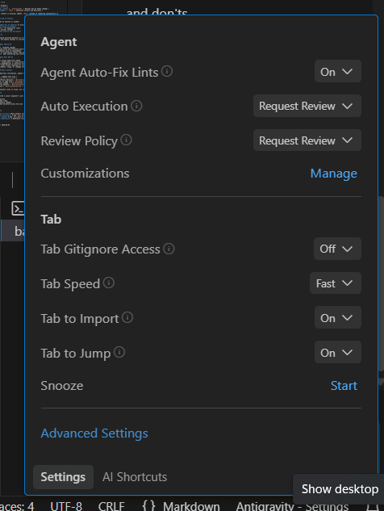
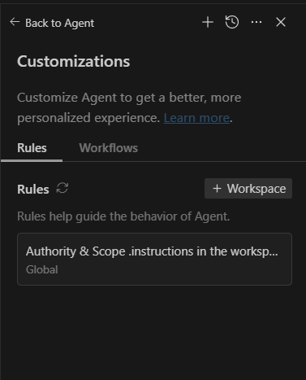

# Project Name

> **Replace this with your actual project name and a one-line tagline**

## 📋 What This Is

Short, direct description of what this project does and why it exists.

---




use this as globel rule 'Always reference the .instructions file in the workspace root for behavioral rules and token efficiency. Use the docs/ folder for modular project knowledge; do not read documentation files unless explicitly needed for the current task. Always provide code as minimal diffs/blocks.'
## 🚀 Quick Start

### First Time Setup

1. **Read the essentials** (in order):
   - [`docs/overview.md`](./overview.md) — Project purpose and scope
   - [`docs/env.md`](./env.md) — Environment setup and dependencies
   - [`docs/architecture.md`](./architecture.md) — System design and structure

2. **Set up your environment**:
   ```bash
   # Follow instructions in docs/env.md
   ```

3. **Start developing**:
   - Review [`docs/conventions.md`](./conventions.md) for coding standards
   - Check [`docs/milestones.md`](./milestones.md) for current priorities

### Before Making Changes

✅ **DO:**
- Read [`.instructions`](../.instructions) — defines how changes are made
- Make minimal, targeted changes
- Match existing patterns and style
- Document non-obvious decisions in `/docs`

❌ **DON'T:**
- Rewrite files without explicit need
- Introduce new dependencies or patterns unnecessarily
- Modify configs, build files, or public APIs without approval

---

## 📁 Repository Structure

```text
/
├─ .instructions        # 🔒 Global agent and workspace rules (AUTHORITATIVE)
├─ docs/                # 📚 Canonical project context and decisions
│  ├─ README.md         # ← You are here
│  ├─ overview.md       # Project intent, scope, success criteria
│  ├─ env.md            # Setup requirements and dependencies
│  ├─ architecture.md   # System design and structure
│  ├─ decisions.md      # Technical decisions and rationale
│  ├─ bugs.md           # Known issues and limitations
│  ├─ milestones.md     # Roadmap and current work
│  ├─ conventions.md    # Coding standards and patterns
│  └─ references.md     # External resources and links
└─ src/                 # 💻 Application code (structure may vary)
```

### 🎯 Rules of Engagement

| File/Folder | Purpose | Authority Level |
|-------------|---------|-----------------|
| `.instructions` | Defines how changes are made | **AUTHORITATIVE** |
| `/docs` | Source of truth for project context | **CANONICAL** |
| `/src` | Implementation code | Follows above rules |

> **⚠️ Important:** Do not bypass or contradict `.instructions` or `/docs` unless explicitly required.

---

## 🧭 Navigation Guide

### For New Developers

| I want to... | Go here |
|--------------|---------|
| Understand what this project does | [`docs/overview.md`](./overview.md) |
| Set up my development environment | [`docs/env.md`](./env.md) |
| Understand the system architecture | [`docs/architecture.md`](./architecture.md) |
| Learn coding conventions | [`docs/conventions.md`](./conventions.md) |
| See what's being worked on | [`docs/milestones.md`](./milestones.md) |
| Check known issues | [`docs/bugs.md`](./bugs.md) |

### For Ongoing Development

| I need to... | Action |
|--------------|--------|
| Make a code change | Review `.instructions` first |
| Document a technical decision | Update `docs/decisions.md` |
| Report a bug or limitation | Update `docs/bugs.md` |
| Propose new work | Update `docs/milestones.md` |
| Find external resources | Check `docs/references.md` |

---

## 💡 Development Principles

This project follows these core principles:

- ✨ **Minimal, intentional changes** — Every change must directly serve a task
- 🔍 **Clarity over cleverness** — Explicit logic beats magic behavior
- 🚫 **No unnecessary abstractions** — Keep it simple until complexity is justified
- 📝 **No undocumented decisions** — Context lives in files, not chat history

---

## 🐛 Known Limitations

All known issues, bugs, and limitations are tracked in [`docs/bugs.md`](./bugs.md).

If you discover a new issue:
1. Document it in `docs/bugs.md`
2. Include reproduction steps and context
3. Link to relevant code or decisions

---

## 🗺️ Roadmap

Current and future work is tracked in [`docs/milestones.md`](./milestones.md).

### Non-Goals

Anything listed as **out of scope** in [`docs/overview.md`](./overview.md) or [`docs/milestones.md`](./milestones.md) is **intentionally excluded**.

---

## 🤖 Working with AI Agents

This project is designed to work efficiently with AI coding assistants.

### 📍 Source of Truth

| What | Where | Purpose |
|------|-------|---------|
| **Agent behavior rules** | `.instructions` | Defines how AI makes changes |
| **Project knowledge** | `/docs` | Canonical context and decisions |

> **💡 Tip:** If context is missing, update `/docs` instead of repeating explanations in prompts.

### 🎬 Starting a New AI Session

When opening a new AI session or window:

1. **Assume the agent has no memory** of previous conversations
2. **Point to the source of truth**:
   - `.instructions` for behavioral rules
   - `/docs` for project context
3. **State the task clearly and narrowly**

**Example prompt:**
```
Implement X following existing patterns in src/components.
Minimal diff. Do not modify configs or introduce new dependencies.
```

### ✅ What the Agent Should Do

- ✔️ Make minimal, targeted changes
- ✔️ Match existing style and structure exactly
- ✔️ State assumptions once if unavoidable
- ✔️ Fail loudly on uncertainty rather than guessing
- ✔️ Update `/docs` when uncovering new context

### ❌ What the Agent Must NOT Do

- ❌ Rewrite files unless explicitly asked
- ❌ Refactor for "cleanliness" or style preferences
- ❌ Introduce new dependencies or patterns without justification
- ❌ Read `/docs` files unless required for correctness
- ❌ Invent requirements, scope, or roadmap items

### 📝 Updating Project Context

If AI uncovers important information, update the appropriate file:

| Discovery Type | Update This File |
|----------------|------------------|
| Non-obvious technical decision | `docs/decisions.md` |
| Bug, limitation, or edge case | `docs/bugs.md` |
| Scope or priority change | `docs/milestones.md` |
| New architectural pattern | `docs/architecture.md` |
| Coding convention | `docs/conventions.md` |

> **Remember:** Context lives in files, not in chat history.

### 🔍 Review Rule

Treat AI output like a junior engineer's pull request:

- ✅ Verify assumptions
- ✅ Check for scope creep
- ✅ Reject unnecessary changes
- ✅ Merge only what directly serves the task

---

## 📞 Getting Help

1. **Check the docs first** — Most answers are in `/docs`
2. **Review recent decisions** — See `docs/decisions.md`
3. **Check known issues** — See `docs/bugs.md`
4. **Ask specific questions** — Reference relevant doc files

---

**Last Updated:** 2026-02-07
